# Admin dashboard: screens and behaviour

Code in `admin/` (Next.js 16, TypeScript). How to run, deploy and what protects it: `admin/README.md`.
The API it talks to: `docs/ADMIN.md` (written with the server). Screenshots are taken by
`admin/scripts/screenshots.mjs` against the mock API (Edge, 1366 px and 390 px wide).

## Design

The same night + gold language as the public site (`admin/src/styles/tokens.css` is a copy of the site's tokens;
dark theme only). System fonts, no icon or UI library, no chart library: the charts are small SVG components with a
data table behind each one. Layout uses logical CSS properties, so Hebrew and Arabic mirror correctly (menu on the
right, arrows flipped, numbers and e-mail addresses stay left-to-right). Text lives in `admin/src/i18n/messages`
(English complete; Hebrew and Arabic complete too - a test fails if a key is missing or has different placeholders).

* Keyboard: skip link, visible focus ring, native `<dialog>` for drawers and confirmations (focus trapped, Escape
  closes), the charts move day by day with the arrow keys.
* Phones: the menu becomes a slide-in panel, tables become cards with the column names as labels, no sideways scroll
  from 360 px.
* Every list has loading, empty, no-match and error states; every destructive action asks first; toasts confirm.

## Screens

| Screen | What it does |
| --- | --- |
| **Sign in** | "Username or e-mail" + password (the first owner's username is his e-mail address); a second step appears when the account has two-factor. One message for a wrong user, wrong password or locked account. Show/hide password, Caps Lock hint, rate-limit message, "session ended" / "signed out for inactivity" notices, and a **Forgot your password?** link. |
| **Forgot password** (`/forgot-password`, public) | E-mail address, **Send the link**, then always the same neutral confirmation ("If an account uses this address, we sent a link. It works for 30 minutes."), whether or not the address has an account; a link back to sign in. A malformed address is caught before sending; rate-limit and "not available" messages. A signed-in visitor is sent to the dashboard. |
| **Choose a new password** (`/reset-password?token=...`, public, the link from the e-mail) | The token is taken from the address and **removed from the address bar at once** (`history.replaceState`); the page sends no Referer and is not cached. New password + repeat, show/hide, Caps Lock hint, the policy checked before sending and the API's own policy answer translated. Success: a confirmation (every session of the account was signed out) and a **Sign in** button. An invalid, used or expired link, or no link: "This link is invalid or has expired. Ask for a new one." with **Ask for a new link**. Reloading the page after the token was removed shows that message too: open the link from the e-mail again. |
| **Dashboard** | A warning when customers paid but have nothing saved; nine figures (orders, revenue, candle requests, messages, products, site and product reviews, prayers, and **Paid, not fulfilled**) that link to their lists; orders + revenue and candle charts for 30 days (keyboard readable, data table behind each); top products; low stock; the five latest orders, candle requests and messages. |
| **Orders** | Search, status filter, sort, pagination, CSV export, detail drawer (deep link `?open=`), **Mark shipped** with a confirm dialog (the API e-mails the customer exactly like the old `orderSent`), delete (owner only). |
| **Payments** | Every PayPal payment the server recorded. Filters: **Paid, not fulfilled** (the customers who paid and have no order or candle request: a warning above the list and on the dashboard), paid, started and not paid, failed, resolved, orders, candles, donations; search by PayPal number, payer or note; detail drawer with the link to the order or candle request; **Mark resolved** (a note is required) and **Reopen**; CSV export of everything or only the unfulfilled. There is no delete. |
| **Candle requests / Messages** | Same pattern: search, filter, drawer with the full text, mark done, delete, CSV export; "reply by e-mail" link on messages. |
| **Products** | Table or grid, stock filter, add / edit form with live preview, photo upload to Firebase Storage (REST, no SDK) or a pasted https address, up to 5 extra photos, category override, stock, featured weight, colours; delete. |
| **Reviews** | Site reviews and product reviews in two tabs: hide / show (moderation) and delete. |
| **Prayers** | Search and delete. |
| **Users** (owner) | Create (password policy checked), change role, disable / enable, delete; you cannot touch your own row. |
| **Privacy requests** (owner) | Type an e-mail address: how many orders, candle requests, messages, site reviews and payments are stored about it (counts only). **Erase this data** asks for the address again, anonymises orders and candle requests, deletes messages and site reviews, removes the payer's details from payments, and says what it did. Both steps are in the audit log, without the address. |
| **Audit log** (owner) | Who did what, when, from which device (IP only as a salted hash); filter by user and action. |
| **Security settings** | Change password (signs out other sessions); two-factor set-up with a QR drawn in the page (`src/lib/qr.ts`, in-house, decoded by an independent decoder in the tests) or the key typed by hand; turn off with password + code. |
| **Profile** | Account, role abilities, session end time, where the key is kept, sign out. |

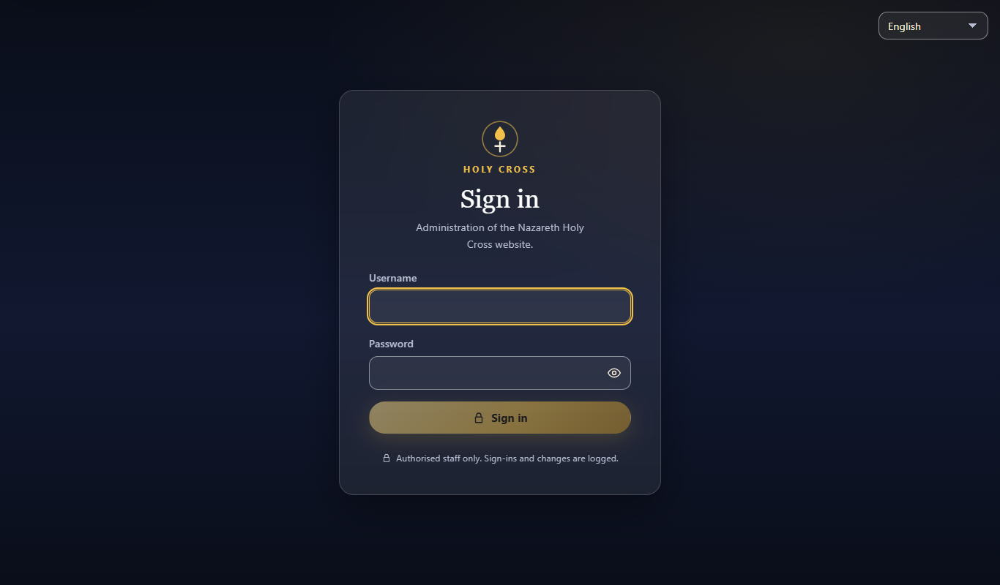
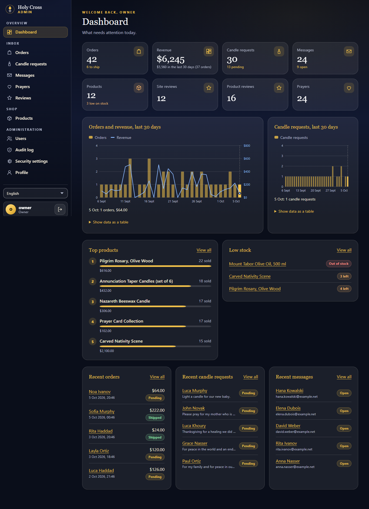
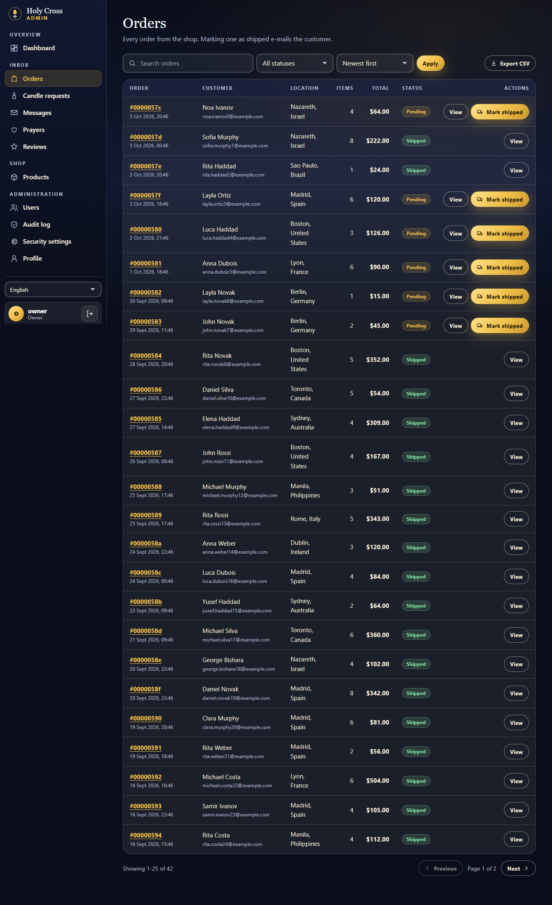
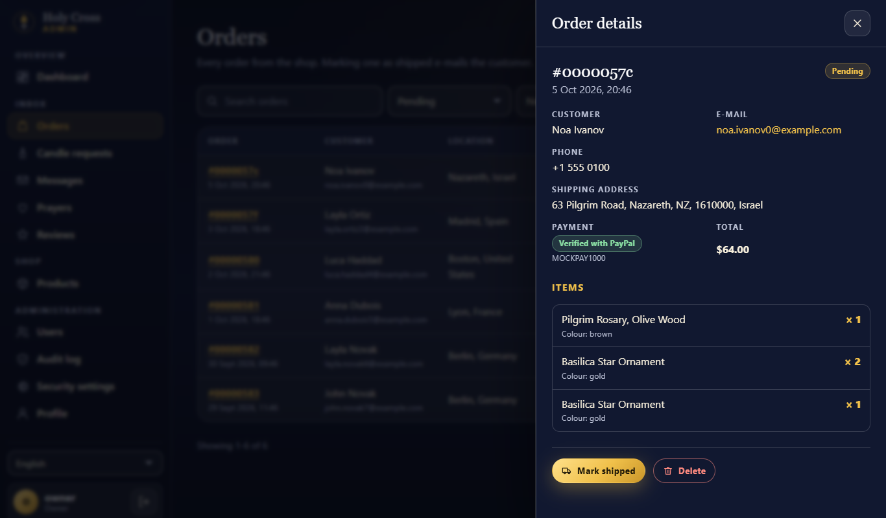
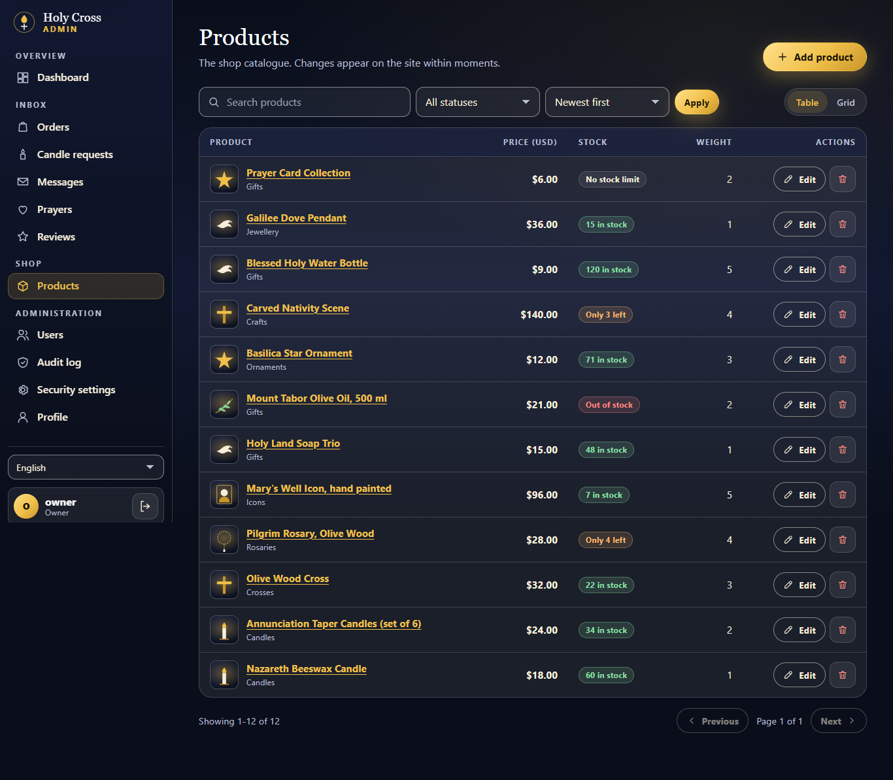
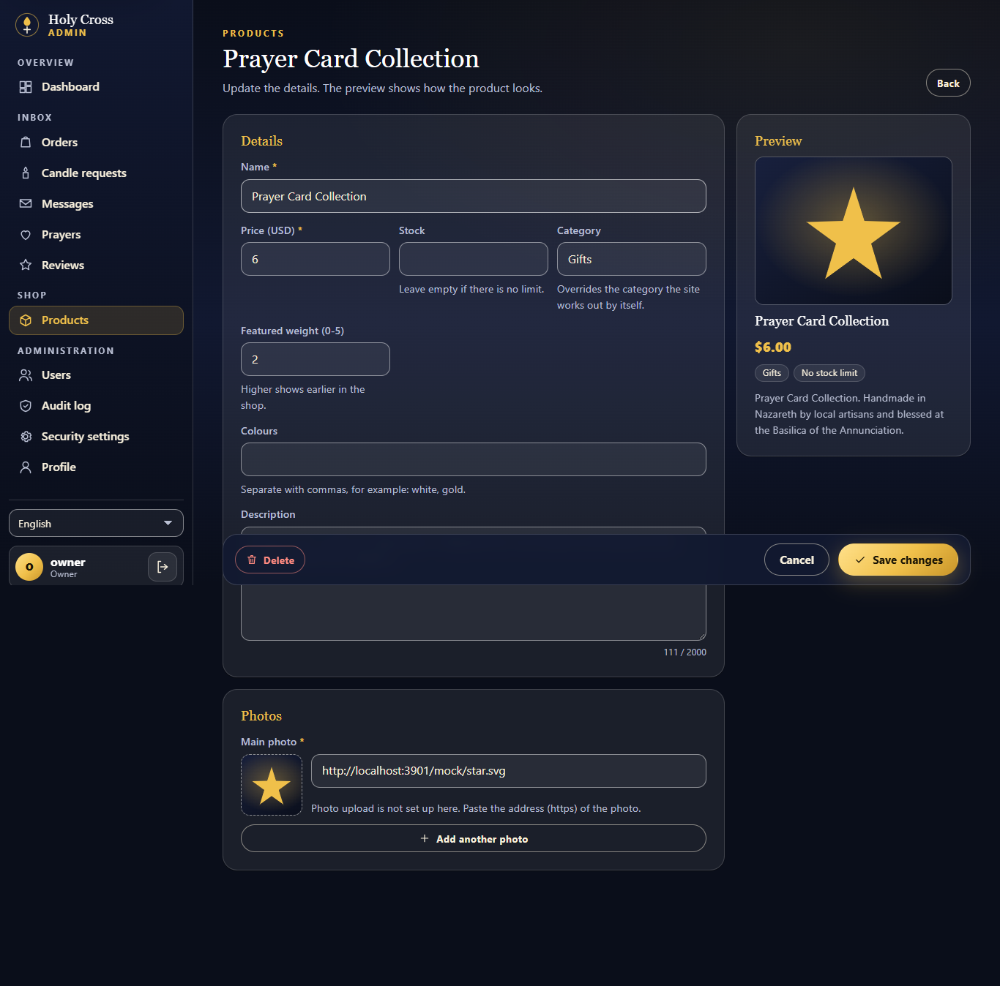
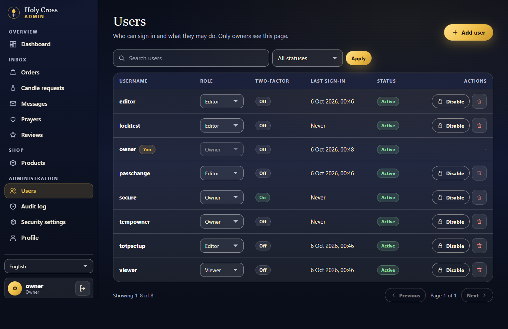
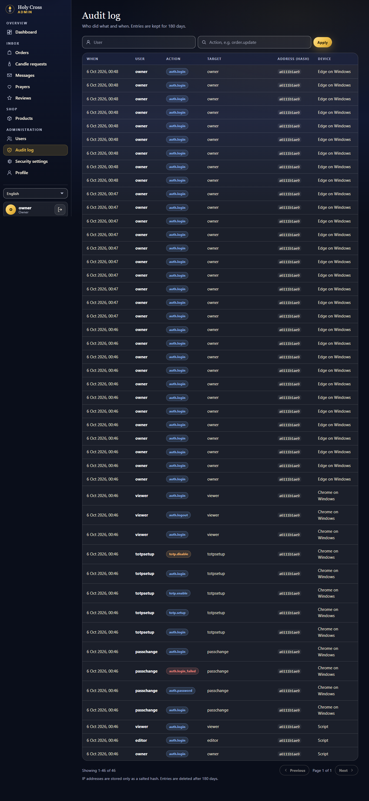
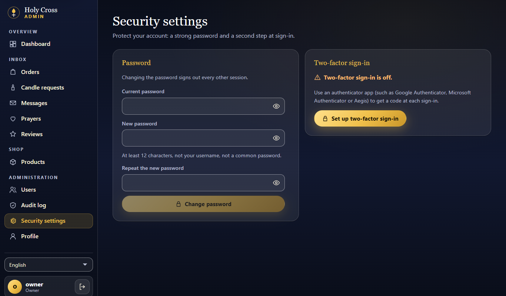

On a phone (390 px):

| Sign in | Dashboard | Orders | Products | Users | Audit |
| --- | --- | --- | --- | --- | --- |
| 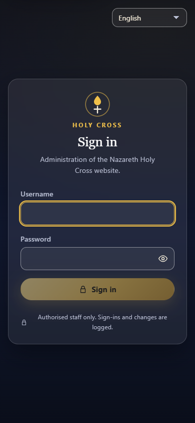 | 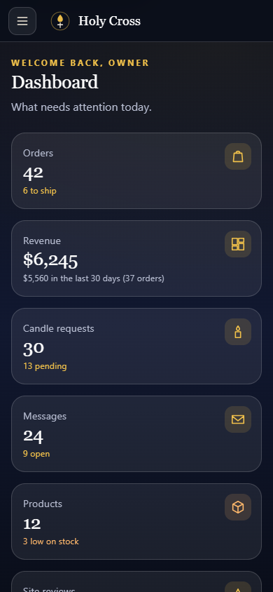 | 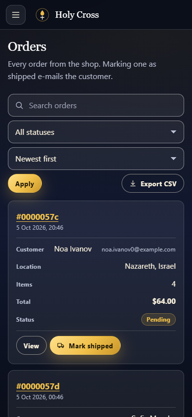 | 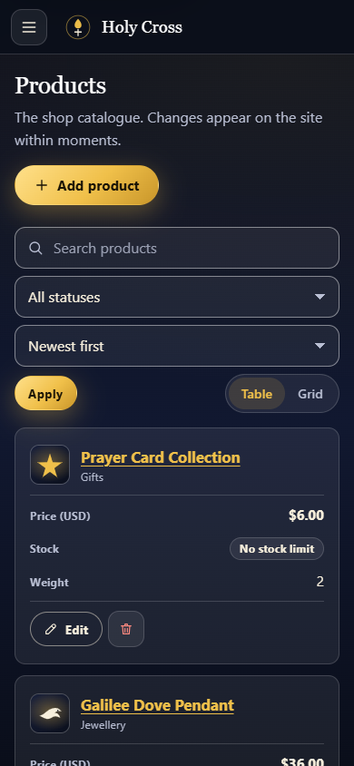 | 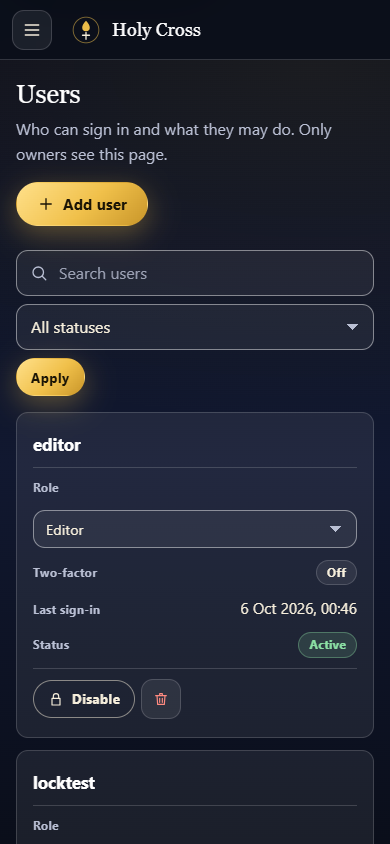 | 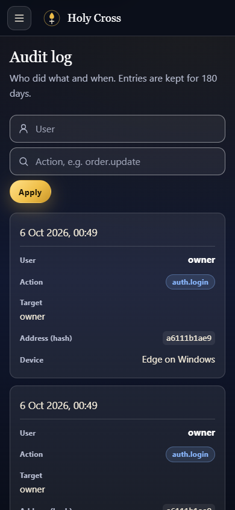 |

## What each role sees

| | Owner | Editor | Viewer |
| --- | --- | --- | --- |
| Dashboard, lists, detail drawers, CSV export | yes | yes | yes |
| Mark shipped / done, hide reviews, edit products, delete messages, requests, prayers | yes | yes | no (buttons are not shown; the API answers 403 anyway) |
| Resolve a payment, export payments | yes | yes | no (read only) |
| Delete orders | yes | no | no |
| Users, Audit log, Privacy requests | yes | no | no |
| Own password and two-factor | yes | yes | yes |

## The contract, as verified against the real API

The dashboard was first built against a mock written from `docs/ADMIN.md`. It was then run, page by page, against
the real API code (`server/test-harness`), which corrected these assumptions. What holds now (each has a test; the
mock and the real API are compared by `admin/tests/unit/parity.test.ts`):

* Items are Mongo documents with `_id`; the UI reads `_id` or `id`. Unknown extra fields are ignored; a missing field
  the UI needs becomes one clear "unexpected answer" error, not a broken page.
* Stored text arrives HTML-escaped (`&amp;`, `&lt;`, `&gt;`): the UI decodes every string it receives once
  (`src/lib/entities.ts`), so forms show what was typed and the API escapes it once more on save.
* `expiresIn` is in seconds (3600). The cookie lives that long.
* Changes answer `{ item }` (orders `{ item, emailSent }`), deletes `{ message }`, creates `201 { item }`. A product is
  updated with PUT or PATCH `/admin/products/:id`; body fields `name, price, img, additionalImageUrls (max 20),
  description, uuidv4_, rate, color[], stock (null = not tracked), category` where `category` is one of eight keys
  (`stained-glass, rosaries, necklaces, bracelets, bibles, crosses, holy-land, gifts`) or null (= from the name), so
  the form offers a choice, not free text. Unknown fields are refused.
* Marking an order shipped e-mails the customer once; the answer's `emailSent` is `true`, `false` (the change is kept,
  the toast says to write to the customer) or `null` (already shipped, nothing sent).
* List filters: `status` is `pending|shipped|unverified` (orders), `pending|done` (candles), `open|done` (contacts),
  `approved|hidden` (reviews), a prayer category, `ok|low|out` (products), `active|owner|editor|viewer|disabled`
  (users); `sort` is a field name, `-field` descending. An unknown status or sort is `400`.
* Every collection has `GET /:id` (the detail drawers open by address). Ids must be 24 hex characters: anything else is
  `400 Invalid id`, which the product page shows as "not found".
* The CSV export is for editors and owners: a viewer gets `403`, so the button is not shown to viewers. Files are
  named `orders-YYYY-MM-DD.csv`; columns are the field names (`id,createdAt,firstName,...`).
* Audit entries: `{ at, actorId, actorName, role, action, target: { type, id }, meta, ipHash, ua }`.
* `GET /admin/auth/me` returns `lastLoginAt`; `/admin/users` items return `totpEnabled`, `lastLoginAt`, `disabled`,
  `lockedUntil`.
* A two-factor code works once and steps only go forward (replay protection): a code just used to set two-factor up
  cannot also sign in within its 30 seconds. The error texts the person can act on are translated by the UI.
* The app forwards the visitor's address (Netlify's header; `X-Forwarded-For` only with `ADMIN_TRUST_XFF=1`) and the
  browser's `User-Agent` for the audit trail.
* Forgotten password (`docs/ADMIN.md` 3.6): `POST /api/session/forgot { email }` answers `202 { ok: true }` for every
  address (`429 { retryAfter }` when limited, `502` when the API cannot be reached); `POST /api/session/reset { token,
  password }` answers `204` (and clears a session cookie this browser still holds, since the API ended every session of
  the account), `400 { error: "link" }` for an invalid, used or expired link, `400 { error: "policy", reason, message }`
  for a password the policy refuses (`reason` is `short`, `long`, `username`, `common`, `repetitive` or null and is
  translated; only an unknown rule shows the API's English text), `429 { retryAfter }`. Both check CSRF, take at most
  2 KB / 4 KB of JSON validated by zod, answer `no-store`, and never log or echo the address, the token or the password.
