# Master design guide: the public site and the admin dashboard

This is the specification every change to what people see must follow, whether a person or an AI agent makes it.
It is written so that someone who has never seen the project can build a new page that looks and behaves exactly
right. It covers the public site (`web/`, live at https://nazarethholycross.com) and the admin dashboard
(`admin/`).

Read it together with `docs/WORKING-AGREEMENT.md` (how to work) and `docs/ENGINEERING.md` (how the system is built).
`docs/DESIGN.md` is the short reference of the shell with its specimen screenshots; this guide is the long form
and wins when the two differ.

**This guide cannot rot silently.** `web/tests/unit/design-guide.test.ts` fails when the guide names a token, a
class, a component, a file or a message key that no longer exists, when a contrast ratio in section 3 no longer
matches `web/src/styles/tokens.css`, when a token or a `ui-*` class exists in the code but is missing here, and
when a path or an image it mentions is gone. If you change a token, a class or a file, update this guide in the
same change (section 12).

How the examples are written: every file path is written from the repository root; a class is written with its
leading dot (`.ui-btn`), a custom property with its dashes (`--gold`), a component in angle brackets
(`<Reveal>`), a message key in dotted form (`ux.share.copied`). The test relies on that.

## Table of contents

1. [Brand and principles](#1-brand-and-principles)
2. [Voice, content and translation rules](#2-voice-content-and-translation-rules)
3. [Visual language](#3-visual-language)
4. [Layout system](#4-layout-system)
5. [Component catalogue](#5-component-catalogue)
6. [Interaction and motion](#6-interaction-and-motion)
7. [Accessibility checklist](#7-accessibility-checklist)
8. [Right-to-left and international rules](#8-right-to-left-and-international-rules)
9. [Performance budgets](#9-performance-budgets)
10. [Security and privacy rules for UI work](#10-security-and-privacy-rules-for-ui-work)
11. [Admin dashboard design rules](#11-admin-dashboard-design-rules)
12. [Definition of done for UI work](#12-definition-of-done-for-ui-work)
13. [Anti-patterns seen in this project](#13-anti-patterns-seen-in-this-project)
14. [How to add a page, a language, a component, a product category, an image set, an admin page](#14-how-to-add-things)

Screenshots in this guide were taken on 2026-10-06 from the live site with Microsoft Edge (Playwright): each image
shows the desktop view (1366 px wide) on the left and the phone view (390 px wide) on the right, the first screen
of the page without scrolling. They are in `docs/design/`. Specimen images of the building blocks (`ds-*.png`) are
in `docs/DESIGN.md`.

## 1. Brand and principles

### 1.1 What this is for

Nazareth Holy Cross lets people anywhere in the world do four things that belong to one pilgrimage: light a prayer
candle in the churches of Nazareth, see the holy sites and the city, buy a keepsake from Nazareth, and support the
work. The owner's requirements are a reliable, fast and secure site that works worldwide, in which nothing is ever
lost, with an admin dashboard that controls the whole site.

### 1.2 Who the visitors are

- **Pilgrims and the homesick, worldwide.** Fourteen languages: en, fr, es, de, it, pt (Brazilian), pl, ru, uk, ro,
  nl, el, he, ar. Two of them (he, ar) are written right to left. Many readers are older, many are on a phone, many
  have a slow or metered connection, many read the site in their second language.
- **People in a prayerful or emotional moment.** They light a candle for someone ill or lost. The interface must
  never feel like a shop checkout while they do that, and never rush them.
- **Buyers of small gifts.** Cart and checkout must be as plain and trustworthy as a good shop, with the price and
  shipping cost visible before the last step.
- **Staff (three roles) in the admin dashboard.** They work in short sessions, often on a phone, and must never
  lose or break data by accident.

### 1.3 What the site must feel like

Four words, in this order of priority:

1. **Reverence.** A night sky, one gold light, slow movement, serif headings, photographs that do the talking. No
   noise, no exclamation marks, no pop-ups, no countdowns, no badges that shout.
2. **Warmth.** The voice is that of a kind host in Nazareth: first person plural ("we will pray for your
   intention"), plain words, thanks at the end. Cream text, not stark white, for reading.
3. **Clarity.** One primary action per view (the gold button). Every page answers three questions at once: where am
   I, what can I do here, what happens next. Anything a visitor must decide is visible before they commit.
4. **Reliability.** Every state exists and is designed: loading, empty, error, offline, slow. A failure never
   loses what the visitor typed, never blames them, and always offers a next step.

The look is called "Immersive pilgrimage": deep blue-black night (`--night`), gold for everything that matters or
can be pressed (`--gold`), cream for text (`--cream`), serif headings (`--serif`), glass cards over photographs
(`.ui-glass`). There is no light theme.

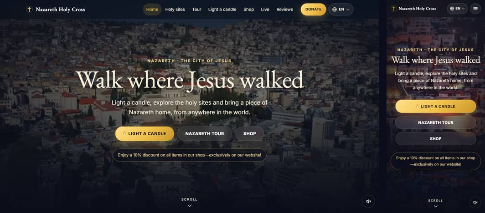

### 1.4 Principles that settle arguments

When two goods collide, the earlier one wins:

1. **Safety and truth** (no wrong price, no wrong promise, no data loss, no leaked secret) beats everything.
2. **Accessibility and inclusion** (keyboard, screen reader, zoom, 14 languages, RTL) beats polish.
3. **Clarity** beats cleverness.
4. **Speed on a slow phone** beats decoration. A flourish that costs bytes on the first screen is refused.
5. **Beauty** beats novelty. Use the existing pattern before inventing one.

### 1.5 What the site never does

These come from `docs/DESIGN.md` section 1 and are enforced by tests or review:

- No newsletter box, no cookie banner, no pop-ups, no "sign up for 10% off" overlays. The only cookie is
  `NEXT_LOCALE` (the language the visitor chose). Adding any non-essential cookie or third-party script changes the
  legal position (`docs/TODO-LEGAL.md`) and needs the owner's decision first.
- No light theme, no theme switch (`color-scheme: dark`).
- No emoji or text glyphs used as icons.
- No colour as the only signal (errors and success always carry an icon or words).
- No autoplaying sound. The hero film is silent and the music toggle is off until the visitor turns it on.
- No dark patterns: no pre-ticked boxes, no fake scarcity, no hidden shipping cost.

## 2. Voice, content and translation rules

### 2.1 Voice in one paragraph

Calm, plain, kind, exact. Short sentences. Say what happened and what to do next. Use "we" for the shop and the
church volunteers, "you" for the visitor. Never blame ("You entered an invalid address") but guide ("Enter a valid
email address, for example name@example.com."). No jargon (not "payload", not "401"), no exclamation marks, no
capital-letter shouting in the text itself (capitals are done by CSS in Latin scripts only, see 3.3), no emoji.
Religious words follow the glossary (`docs/GLOSSARY.md`): one approved word per concept in every language.

### 2.2 Rules per type of text

| Type | Rule | Example (English, from `web/src/messages/en.json`) |
|---|---|---|
| Page title (`<h1>`) | One per page. A phrase a person could say, 2 to 7 words, serif. Sentence case. No full stop. | "Souvenirs from Nazareth" |
| Eyebrow | One or two words above a title, naming the kind of page. Written in normal case in the message; CSS uppercases it in Latin scripts. | `home.eyebrow` |
| Lead / intro | One or two sentences under the title that say what the page offers. Muted colour on night; cream with a dark halo on a hero photograph. | "Rosaries, crosses, stained glass and keepsakes from the city of the Annunciation, sent to your door." |
| Section heading (`<h2>`) | A noun phrase or short invitation. Sentence case. | "How to light a candle?" |
| Primary button | A verb (or verb + object), 1 to 3 words. One gold button per view. | "Light a candle", "Add to cart", "Back to home" |
| Secondary button | Same style, ghost or glass variant. | "Try again" |
| Link text | Says where it goes. Never "click here". External links also announce "opens in a new tab" (`placesPage.newTab`, visually hidden). | "View on Google Maps" |
| Form label | A noun, above the field, always visible. The placeholder is never the label. | "Email" |
| Hint | One short sentence under the field, muted. | "We never share your address." (shape) |
| Field error | Starts with what to do, polite, specific, with an example when it helps. Linked with `aria-describedby`. | `checkoutPage.form.errors.email` |
| Form-level error | "Please correct the highlighted fields." Uses `<Notice>`. | `checkoutPage.form.fixErrors` |
| Server or network error | "We could not ...", then the next step. Never "Error 500", never a stack trace. States who is at fault only when it is us ("Something went wrong on our side."). | `pilgrim.contact.errors.network` |
| Payment text | Reassure about money first: "You have not been charged." | `checkoutPage.payment.cancelled` |
| Empty state | Title says what is missing, text says how to fill it, one action. | `shopFeatures.wishlist.emptyTitle` + `shopFeatures.wishlist.emptyText` |
| Loading text | One word, "Loading...", only for assistive technology on skeletons. | `ux.loading` |
| Success / toast | Short past tense, no thanks needed in a toast. Thanks belong on the confirmation page. | `ux.share.copied` |
| Confirmation page | Warm, complete, repeats what was ordered and what happens next, ends with gratitude. | `thankYou` block |
| Legal text | Plain language, written per language in `pilgrim.legal` (not generated from English at run time), headed sections, a "last updated" date, a jump list. Never legal Latin. Real figures (shipping fees, delivery times) are filled in from data, not typed twice. | `/privacy`, `/terms`, `/shipping-returns` |
| Alt text of photographs | Describes what is seen, not the file. Licensed photos build it from `topic` + `subject` per language (`media.topic.*`, `media.subject.*`). A purely decorative photo has `alt=""`. | "Mary's Well: the well, photo 3 of 10" |
| `aria-label` | Names an icon-only control by its action ("Close", "Open menu"). Comes from messages like all text. | `ux.toast.dismiss` |
| Page `<title>` and description | Built by `pageMetadata` (`web/src/lib/seo.ts`): title + " · Nazareth Holy Cross", a description under about 160 characters. | |

Known legacy copy that breaks these rules and should be fixed when its page is next touched (found on the live
site on 2026-10-06; they come from the previous site's strings and were not changed by this guide): the candle
form heading reads "LIGHT A PRAY CANDLE" (`candle.lightAPrayCandle`; it should read "Light a prayer candle" in
normal case), the empty cart title is Title Case ("Your Cart is Empty", `cart.emptyCart`), and several form
labels are Title Case ("First Name"). New text is always sentence case.

### 2.3 Translation rules

- **Every visible word goes through next-intl.** Text lives in `web/src/messages/<locale>.json` for all 14
  languages, with ICU placeholders. `npm run lint` rejects letters inside JSX text, in string literals inside JSX,
  and in `alt`, `aria-label`, `title`, `placeholder` attributes.
- **No concatenation.** Never build a sentence from pieces (`t('a') + ' ' + name`) and never build a plural by
  hand. Word order, case and plural forms differ per language. Use one message with placeholders:
  `"{count, plural, one {# photo} other {# photos}}"`, `"Follow us on {network}"`. Russian, Ukrainian and Polish
  must spell out `one few many other`, Arabic `one two few many other`, Romanian `one few other`;
  `web/tests/unit/messages.test.ts` fails otherwise.
- **Straight apostrophes start ICU quotes.** In languages that use an apostrophe, write the typographic one
  (U+2019) in the message.
- **Keys:** namespaced and stable (`ux.share.copied`). A key used by shell components goes into the `ux`
  namespace. Do not reuse a message for a different meaning because the English words match.
- **Glossary:** one approved word per concept per language: `docs/GLOSSARY.md`. Brand and proper names
  (Nazareth Holy Cross, PayPal, Instagram, Facebook, YouTube, Google) are never translated. "Nazareth Holy Cross"
  stays in Latin letters inside Hebrew, Arabic, Cyrillic and Greek text.
- **Register:** one address form per language, as listed in the glossary (de "Sie", fr "vous", es "tu", ...).
- **Digits:** Western digits (0-9) in every language, including Hebrew and Arabic. Use `Intl` with
  `numberingSystem: 'latn'` (`web/src/lib/pricing.ts` for prices, the pattern in
  `web/src/components/home/VerseOfDay.tsx` for dates). Prices are US dollars; a hint in the visitor's currency is
  shown only by `<CurrencyNote>` and is always labelled approximate (`web/src/lib/currency.ts`). Dates and times
  of events are in Nazareth time (`Asia/Jerusalem`).
- **Typography per language:** French uses a no-break space before `: ; ? ! >>` and `%`; quotation marks follow the
  language (glossary).
- **Length:** German, Russian, Ukrainian and Greek texts are commonly 30 to 40 percent longer than English. Layouts must survive that (no fixed widths on text, `overflow-wrap`, hyphenation by `lang`, see 8.4).
- **Missing keys:** English is the fallback at run time, but a missing key fails the unit tests, so there is never a
  gap in practice. Machine-translated text still waits for native review (`docs/TRANSLATION-REVIEW.md`); do not
  claim otherwise.
- **Unused or unknown keys fail the tests** (`web/tests/unit/i18n-usage.test.ts`): delete a message when you delete
  its last use.

## 3. Visual language

### 3.1 Colour tokens

All colours come from `web/src/styles/tokens.css`. The admin has a copy of the colour tokens
(`admin/src/styles/tokens.css`) plus a few data-UI additions. A raw hex, `rgb()` or `hsl()` value in any other
stylesheet fails `web/tests/unit/conventions.test.ts`; use a token, or mix one with `color-mix(in srgb, var(--gold)
40%, transparent)`.

| Token | Value | Use |
|---|---|---|
| `--night` | `#0a0e1a` | page background, text on gold |
| `--night-2` | `#111830` | raised surface, end of the page gradient, toasts, menus |
| `--night-3` | `#18203d` | fields, filled menu surfaces |
| `--night-deep` | `#070a13` | footer end of the night gradient |
| `--gold` | `#f0c04a` | accent: everything that matters or can be pressed, focus ring, eyebrows, links |
| `--gold-deep` | `#c9962a` | end of the gold button gradient, pressed look |
| `--gold-light` | `#ffe08a` | start of the gold gradient, link hover |
| `--gold-soft` | `rgba(240, 192, 74, 0.14)` | tinted fill for "current" and "selected", badges |
| `--on-gold` | `#1a1405` | ink on gold surfaces (button text) |
| `--cream` | `#f7efdc` | body text |
| `--white` | `#ffffff` | titles over photographs, strong text |
| `--muted` | `#b9bfd3` | secondary text, labels, hints |
| `--danger` | `#ff8a80` | errors (with an icon or words) |
| `--success` | `#8be0a4` | confirmations (with an icon or words) |
| `--live` | `#ff4d4f` | reserved for an "on air" badge; no component uses it today (see the contrast note below) |
| `--glass` | `rgba(255, 255, 255, 0.07)` | translucent card fill |
| `--glass-strong` | `rgba(255, 255, 255, 0.12)` | hover fill, shimmer highlight |
| `--glass-line` | `rgba(255, 255, 255, 0.16)` | hairline border of cards (decorative, 1.56:1) |
| `--field-line` | `rgba(255, 255, 255, 0.45)` | border of text fields (4.52:1, WCAG 1.4.11) |

Admin-only additions (`admin/src/styles/tokens.css`): `--info` `#8ab8ff`, `--warn` `#ffb86b`, and the soft fills
`--info-soft`, `--warn-soft`, `--success-soft`, `--danger-soft`, plus `--row-hover`, `--sidebar-w` and `--mono`.

Gradients: `--grad-gold` (primary buttons, reading-progress bar), `--grad-night` (page background), `--grad-glow`
(soft gold light, top right), `--grad-scrim` (dimming over a photograph), `--grad-card-shade` (text over a card
photograph). Glow: `--glow-gold` (shadow of gold buttons).

**Rules of use**

- Gold means "this matters or can be pressed". Never use gold for decoration that is not interactive or important.
- Text sits on `--night`, `--night-2`, `--night-3` or on `.ui-glass`. Never place muted or gold text on a photograph
  without a scrim (`--grad-scrim`, `--grad-card-shade`).
- Status colours need a second signal (icon, words, shape).
- `--gold-deep` is a gradient end, not a text colour on night.

### 3.2 Contrast ratios (computed)

WCAG 2.2 relative luminance, translucent colours composited over `--night` (and over the stated surface). The
unit test recomputes every row from `web/src/styles/tokens.css` (and `admin/src/styles/tokens.css` for the
admin-only tokens) and fails if a number here is off by more than 0.01 or a pass mark is wrong. Columns: normal
text under 18 px needs 4.5; large text (24 px, or 19 px bold) and UI components need 3; 7 is AAA.

| Pair (foreground on background) | Ratio | Text under 18 px (4.5) | Large text and UI (3) | AAA (7) |
|---|---|---|---|---|
| `--cream` on `--night` | 16.81 | pass | pass | pass |
| `--cream` on `--night-2` | 15.32 | pass | pass | pass |
| `--cream` on `--night-3` | 13.97 | pass | pass | pass |
| `--cream` on `--glass` | 14.38 | pass | pass | pass |
| `--white` on `--night` | 19.25 | pass | pass | pass |
| `--muted` on `--night` | 10.50 | pass | pass | pass |
| `--muted` on `--night-2` | 9.57 | pass | pass | pass |
| `--muted` on `--night-3` | 8.73 | pass | pass | pass |
| `--muted` on `--glass` | 8.98 | pass | pass | pass |
| `--muted` on `--glass-strong` | 7.72 | pass | pass | pass |
| `--gold` on `--night` | 11.32 | pass | pass | pass |
| `--gold` on `--night-2` | 10.31 | pass | pass | pass |
| `--gold` on `--night-3` | 9.40 | pass | pass | pass |
| `--gold` on `--glass` | 9.68 | pass | pass | pass |
| `--gold` on `--gold-soft` | 8.75 | pass | pass | pass |
| `--gold-deep` on `--night` | 7.22 | pass | pass | pass |
| `--gold-light` on `--night` | 14.93 | pass | pass | pass |
| `--on-gold` on `--gold` | 10.77 | pass | pass | pass |
| `--on-gold` on `--gold-light` | 14.20 | pass | pass | pass |
| `--on-gold` on `--gold-deep` | 6.87 | pass | pass | FAIL |
| `--night` on `--gold` | 11.32 | pass | pass | pass |
| `--danger` on `--night` | 8.43 | pass | pass | pass |
| `--danger` on `--night-2` | 7.68 | pass | pass | pass |
| `--danger` on `--glass` | 7.21 | pass | pass | pass |
| `--danger` on `--danger-soft` | 6.87 | pass | pass | FAIL |
| `--success` on `--night` | 12.19 | pass | pass | pass |
| `--success` on `--glass` | 10.43 | pass | pass | pass |
| `--success` on `--success-soft` | 9.24 | pass | pass | pass |
| `--info` on `--night` | 9.52 | pass | pass | pass |
| `--info` on `--info-soft` | 7.49 | pass | pass | pass |
| `--warn` on `--night` | 11.30 | pass | pass | pass |
| `--warn` on `--warn-soft` | 8.74 | pass | pass | pass |
| `--white` on `--live` | 3.27 | FAIL | pass | FAIL |
| `--night` on `--live` | 5.89 | pass | pass | FAIL |
| `--gold` on `--night` as a focus ring or icon | 11.32 | pass | pass | pass |
| `--cream` on `--night` as a focus ring on a gold button | 16.81 | pass | pass | pass |
| `--field-line` on `--night` (border of a field) | 4.52 | pass | pass | FAIL |
| `--glass-line` on `--night` (decorative hairline) | 1.56 | FAIL | FAIL | FAIL |
| `--danger` on `--night` as an error border | 8.43 | pass | pass | pass |

How to read the failures:

- `--on-gold` on `--gold-deep` is 6.87: passes AA, misses AAA. The gold button's gradient ends in `--gold-deep`, so
  the label on the far end of a wide button is at 6.87; that is still AA and is accepted.
- `--white` on `--live` is 3.27: **never put white small text on `--live`.** If an "on air" badge is built, use
  `--night` text (5.89) or a larger bold label, and keep a text word ("Live") next to the colour.
- `--glass-line` is decorative: it separates cards from the background but carries no information. Anything that
  must be seen to operate a control (a field border, a focus ring, a checkbox edge) uses `--field-line` or `--gold`.
- A cream focus ring on a gold button is offset from the button (`--focus-offset` 3px), so it sits on the page
  background, not on the gold; the ratio that matters is cream on night.

Other computed facts: the placeholder colour (`--muted` at 70% over the field fill) is 5.20:1; the admin's
`.btn--danger` ink `#2a0a07` on `--danger` is 8.03:1.

**High-contrast mode** (the accessibility panel, section 5.5) redefines the colour tokens under
`:root[data-a11y-contrast='high']` at the end of `web/src/styles/tokens.css`: black surfaces, white text, a brighter
gold (`#ffd75e`), opaque glass and strong borders; gradients and glows become flat and the photo scrim deepens to at
least 78% black. Every text pair in use reaches AAA; `web/tests/unit/a11y.test.tsx` recomputes them (the rows below
name the colours without backticks, so the table test above does not read them as base values):

| Pair in high contrast | Ratio |
|---|---|
| cream on night (both redefined: white on black) | 21.00 |
| cream on night-3 (fields) | 18.73 |
| muted on night / on night-3 / on glass-strong | 16.21 / 14.46 / 10.50 |
| gold on night / on night-3 / on gold-soft | 15.13 / 13.50 / 10.12 |
| on-gold on gold (buttons) / on gold-light | 15.13 / 17.46 |
| danger on night / success on night | 11.62 / 15.72 |
| glass-line on night (card borders, now well above 3:1) / field-line on night | 9.96 / 21.00 |

### 3.3 Typography


**Fonts** (self-hosted by `next/font` in `web/src/lib/fonts.ts`; no request to Google from the visitor's browser):

| Script | Serif (headings, brand) | Sans (text, controls) | CSS variable pair |
|---|---|---|---|
| Latin, Cyrillic, Greek | EB Garamond | Inter | `--font-serif`, `--font-sans` |
| Hebrew | Frank Ruhl Libre | Heebo | `--font-he-serif`, `--font-he-sans` |
| Arabic | Amiri | IBM Plex Sans Arabic | `--font-ar-serif`, `--font-ar-sans` |

`--serif` and `--sans` (in `tokens.css`) switch to the Hebrew or Arabic pair under `:root:lang(he)` and
`:root:lang(ar)`, falling back to the Latin pair, then to system fonts. `--symbols` is for glyphs a page font may
lack (the 14 language names in the menu, rating glyphs). Only the two Latin files are preloaded; the other
scripts download by unicode-range only on pages that show them. Never add a second instance of the same family
(duplicate downloads), never name a typeface in a component stylesheet (`font-family` must be `var(--serif)`,
`var(--sans)`, `inherit` or `initial`; checked by the conventions test). The admin uses system font stacks and
downloads no font at all.

**Scale.** Fluid with `clamp()`, so there are no per-breakpoint font sizes. Body text is never below 1rem (16 px;
inputs are 16 px so iOS does not zoom). Computed sizes in px:

| Token or class | Definition | 360 px | 390 px | 768 px | 1366 px | 1920 px |
|---|---|---|---|---|---|---|
| `--text-xs` | `0.78rem` | 12.5 | 12.5 | 12.5 | 12.5 | 12.5 |
| `--text-sm` | `0.9rem` | 14.4 | 14.4 | 14.4 | 14.4 | 14.4 |
| `--text-base` | `1rem` | 16 | 16 | 16 | 16 | 16 |
| `--text-lg` | `clamp(1.08rem, 0.35vw + 1rem, 1.2rem)` | 17.3 | 17.4 | 18.7 | 19.2 | 19.2 |
| `--text-xl` | `clamp(1.25rem, 1vw + 1rem, 1.5rem)` | 20.0 | 20.0 | 23.7 | 24.0 | 24.0 |
| `--text-2xl` | `clamp(1.6rem, 2.6vw + 0.9rem, 2.4rem)` | 25.6 | 25.6 | 34.4 | 38.4 | 38.4 |
| `--text-3xl` | `clamp(1.9rem, 4.2vw + 0.8rem, 3rem)` | 30.4 | 30.4 | 45.1 | 48.0 | 48.0 |
| `--text-4xl` | `clamp(2.1rem, 6vw + 0.6rem, 3.8rem)` | 33.6 | 33.6 | 55.7 | 60.8 | 60.8 |
| `.ui-hero__title` | `clamp(2rem, 6vw, 3.6rem)` | 32.0 | 32.0 | 46.1 | 57.6 | 57.6 |
| `.ui-h2` | `clamp(1.7rem, 4.6vw, 2.8rem)` | 27.2 | 27.2 | 35.3 | 44.8 | 44.8 |
| `.ui-h3` | `clamp(1.2rem, 2.6vw, 1.5rem)` | 19.2 | 19.2 | 20.0 | 24.0 | 24.0 |

Roles:

| Role | Style |
|---|---|
| Page title | `.ui-hero__title`: serif, weight 400, `--leading-tight`, white, `text-wrap: balance`, hyphenated by language |
| Section heading | `.ui-h2`: serif 400, white. Sub-heading `.ui-h3`: serif 400, gold |
| Eyebrow | `.ui-eyebrow`: sans 700, 0.78rem, `letter-spacing: 0.22em`, uppercase, gold |
| Body | sans, `--text-base`, `line-height: var(--leading-body)` (1.65; 1.8 in Hebrew and Arabic) |
| Reading text | `.ui-prose`: measure `--measure` (68ch), `text-wrap: pretty` |
| Button | sans 700, 0.95rem, `letter-spacing: 0.04em`, uppercase (Latin only) |
| Label, hint | 0.85rem, `--muted` |
| Brand name in the header | serif 600, 1.2rem, `letter-spacing: 0.04em`, white |

Line height tokens: `--leading-tight` 1.15 (1.3 in he and ar), `--leading-body` 1.65 (1.8 in he and ar).

Per-script rules: Hebrew and Arabic never get letter-spacing or uppercase (`:lang(he)`, `:lang(ar)` rules in
`web/src/styles/ui.css`), are never hyphenated, and get the taller line. Long Russian, German, Greek and Polish
hero titles shrink on phones instead of breaking mid-word. Weights: serif headings 400 (never bold serif), sans 400
for text, 600-700 for emphasis and controls. No italics for emphasis in UI text; quotations (Bible verses) may be
italic only where the component already is.

### 3.4 Spacing, radius, elevation, layers, motion

**Spacing** (4 px base): `--space-1` 4, `--space-2` 8, `--space-3` 12, `--space-4` 16, `--space-5` 24, `--space-6` 32,
`--space-7` 48, `--space-8` 64, `--space-9` 96. `--page-gutter` is 16 (the side margin of `.ui-container`).
Section rhythm: `.ui-section` has `clamp(40px, 7vw, 80px)` block padding. Grid gaps are `clamp(16px, 2.4vw, 24px)`
(`.ui-grid`). Use the scale; a one-off pixel value needs a reason in a comment.


**Radius:** `--radius` 20px (cards, glass panels), `--radius-sm` 12px (fields, small panels, alerts), `999px`
(pills: buttons, badges, chips), `50%` (round icon buttons). No other radii.

**Elevation:** `--elev-0` none, `--elev-1` (resting hairline), `--elev-2` (raised), `--elev-3` (cards;
`--shadow` is the same value), `--elev-4` (menus, toasts, hover, with a 1px glass ring). Helpers `.ui-elev-1`
to `.ui-elev-4` apply a shadow only. `--glow-gold` is for gold buttons.

**Layers (z-index tokens):** `--z-sticky` 40 (sticky actions), `--z-header` 50, `--z-menu` 60, `--z-toast` 80,
`--z-skip` 100. The reading-progress line is `--z-header` + 1 (51). The admin adds `--z-dialog` 70. Never write a
raw `z-index` number in a component.

**Header offset:** `--header-h` 68px and `--scroll-offset` (header + 16px). `html { scroll-padding-top }` keeps
in-page jumps and keyboard focus from hiding under the sticky header; do not add your own `scroll-margin-top` for
that.

**Touch target:** `--tap` 44px for everything pressable in the header, footer and shared components (WCAG 2.2
asks 24px; we hold 44).

**Motion tokens:** `--ease-out` `cubic-bezier(0.2, 0.7, 0.2, 1)`, `--dur-fast` 0.15s (colour, hover), `--dur-base`
0.25s (lifts, drawers), `--dur-slow` 0.6s (reveals, page rise). Details in section 6.

**Focus tokens:** `--focus-color` (gold), `--focus-width` 3px, `--focus-offset` 3px, `--focus-ring` (the shorthand).

### 3.5 Imagery

Photographs are the point of the site. The rules:

- **Licensed or owned photos only.** The 40 Nazareth photos come from Wikimedia Commons with licences that allow
  the use (public domain, CC0, CC BY, CC BY-SA) and a named author. They are built by `web/scripts/media/build.mjs`
  from `web/scripts/media/sources.json`; the builder re-reads the licence and stops if it is not allowed
  (`docs/MEDIA.md`). Never add a photo found by a web search, a stock photo without a licence record, a screenshot,
  or anything with a watermark, a brand, a political banner, a minor, or an identifiable person as its subject.
- **Credit.** The author and licence are always in text: the photo viewer caption and `/credits`
  (`web/src/app/[locale]/credits/page.tsx`), linked from the footer on every page. Structured data carries them too.
- **Component.** A licensed photo is shown with `<MediaPicture>` (`web/src/components/media/MediaPicture.tsx`):
  `<picture>` with AVIF then WebP in every generated width, a 16px blur placeholder (`blurDataURL`) shown as the
  background while it loads, and a crop that follows the focal point. Pass an honest `sizes`.
  `<PageHero media={getMedia('id')}>` is the usual way for a page header. Older photos in
  `web/public/images/{latin,greek,mary,old,nazareth}` go through `next/image` and are used only where no licensed
  photo exists yet. Product photos come from Firebase Storage through `next/image`.
- **Aspect ratios in use:** page hero 260-420 px tall band (`min-height: clamp(260px, 42vh, 420px)`) full width; a
  holy-site hero is taller (`tall`) and a phone crops it sideways around `heroFocus`; site cards 16 / 10; product
  cards and gallery thumbnails 1 / 1; product main photo 4 / 5 or 1 / 1 frame; candle church cards 16 / 9; social
  card 1200 x 630 (`og.jpg`).
- **Focal points.** `focal` (percent from left and top) in `sources.json` decides what stays in view when the photo
  is cropped; a place has `heroFocus` (CSS `object-position`) for its hero. Check every hero on a 390 px phone.
- **A photo that covers a box taller than wide** (a hero on a phone) is cropped sideways, so the file must be wider
  than the screen: heroes use `sizes="(max-width: 767px) 740px, 100vw"` (a phone takes the 1920 px file), full-width
  bands use `100vw`.
- **Hero treatment:** a light veil on top, a soft pool of shade behind the title, the foot fading into night
  (`--grad-scrim` for page heroes). Text over a photo is white or cream and must pass 4.5:1 against the *worst*
  part of the scrim, checked visually at both widths.
- **Priority:** only the hero (the likely Largest Contentful Paint) is `priority` (eager, `fetchpriority=high`,
  preloaded). Everything else is lazy. Never put `priority` on more than one image per page.
- **Weight:** the home hero uses lean copies (`<MediaPicture lean />`, AVIF quality 38) because it sits under a
  dark gradient. Photos that are looked at (gallery, viewer) stay at full quality.
- **Video:** the home hero loop is silent, 16 seconds, AV1/WebM then H.264/MP4, mounted only on screens 768 px or
  wider, not under `prefers-reduced-motion`, `Save-Data` or a 2g/3g connection, only after the `load` event and
  when the browser is idle (`web/src/components/home/HeroVideo.tsx`). Other videos use `preload="none"` and a
  licensed poster. A video over 8 MB does not go in the repository (upload it to Firebase Storage). Videos that carry
  speech need captions (WCAG 1.2.2: still an open content task, `docs/QA.md`).
- **Photo of a person:** only where incidental. Never a minor as the subject, never someone praying who could be
  identified, never a face in a thumbnail.

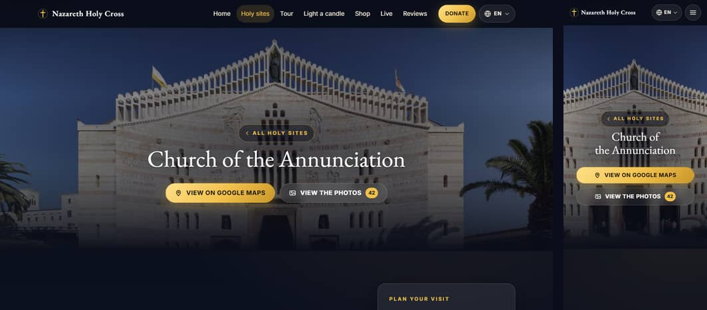

### 3.6 Iconography

One inline-SVG set, `web/src/components/ui/icons.tsx` (24px grid, 2px round stroke, `currentColor`, decorative
`aria-hidden`), built on `<SvgIcon>` (`web/src/components/ui/SvgIcon.tsx`). Size with the `size` prop or
`--icon-size`; colour follows the text. Icons that point along the reading direction (`ArrowEndIcon`,
`ArrowStartIcon`, `ChevronEndIcon`, `ChevronStartIcon`) take `flip` and mirror in right-to-left; `.ui-flip-rtl`
does the same for any element. `<CrossMark>` is the brand mark. Older icon files (`web/src/components/home/icons.tsx`,
`web/src/components/places/icons.tsx`, `web/src/components/community/Icon.tsx`, `web/src/components/shop/ShopIcon.tsx`,
`web/src/components/checkout/icons.tsx`) share the look. Never use an icon font, an emoji, or a text glyph. An icon
never carries meaning alone: the text or `aria-label` beside it does. A new icon is drawn on the 24px grid with the
same stroke, in the file of the set that fits. The admin has its own set in `admin/src/components/ui/Icon.tsx`.


## 4. Layout system

### 4.1 Page frame

Every localized page is rendered by `web/src/app/[locale]/layout.tsx`:

```
<html lang dir>            lang and dir come from the URL language; dir="rtl" for he and ar
  <head>                     one inline script with the CSP nonce: applies the accessibility settings (5.5) before the first paint
  <body>
    <ReadingProgress/>     3px gold line at the very top (long pages only)
    <SiteHeader/>          sticky, 68px (--header-h), skip link first
    <main id="main" tabIndex=-1>   focus target of the skip link and of RouteFocus
      <div class="ui-page">...</div>   the page: night background + gold glow
    </main>
    <SiteFooter/>
    <BackToTop/> <RouteFocus/> <PageTransitions/> <ToastProvider/>
```

Every page's own root is `<div className="ui-page">` (add its module class beside it: `ui-page ${styles.page}`).
The page body is a stack of sections. Each section is `<section className="ui-section" aria-labelledby="...">`
holding `<div className="ui-container">`.

### 4.2 Container, grid, breakpoints

- **Container:** `.ui-container` is `width: min(var(--container), 100% - 32px)`, centred. `--container` is 1180px
  and the gutter is 16px on each side (`--page-gutter`). Reading text inside it is capped with `.ui-prose`
  (`--measure` 68ch).
- **Section rhythm:** `.ui-section` (`clamp(40px, 7vw, 80px)` block padding). Section heading block is centred,
  `max-width: 760px`.
- **Card grid:** `.ui-grid` is `repeat(auto-fill, minmax(min(100%, 260px), 1fr))` with a fluid gap. Page-specific
  grids use `grid-template-columns: minmax(0, 1fr) ...` (the `minmax(0, ...)` stops long words from stretching a
  column).
- **Mobile first.** Write the phone layout as the base and add `@media (min-width: ...)` upwards. Phones are the
  main device: design the 390 px view first, check 360 px (no horizontal scroll; an automated test asserts it on
  every page), and 320 px / 400% zoom (reflow).
- **Breakpoints in use** (there is no breakpoint token; stay on these values so layouts change together):

| Width | What changes |
|---|---|
| 480 / 560 px | Header on phones (480): the brand name may wrap onto two lines and the language button drops its caret, so the brand and the three round buttons fit down to 320 px. Phone adjustments inside single components: the hero title shrinks for long Russian, German, Greek and Polish words (480), the shop toolbar reflows (559), candle church cards grow taller (560) |
| 640 / 700 px | Holy-site gallery 3 columns (640); shop product grid 3 columns (700) |
| 768 px | The home hero film may mount (JavaScript check in `HeroVideo`); the hero photo size hint changes |
| 860 / 900 / 920 px | Two-column layouts begin: contact, product, cart, story + visit card, checkout |
| 960 / 1000 px | Candle page two columns; footer five columns; gallery 4 columns |
| 1040 px | Shop: filter sidebar (250px) replaces the filter drawer |
| 1180 px | Header: at and below it the links become a drawer behind the menu button (at every width when the accessibility panel enlarges the text) |
| 1240 px | Header: the gold "Donate" button joins the bar, except in Polish, Russian, Greek, Ukrainian and Dutch, whose longer labels leave no room for it next to the accessibility button (`web/tests/e2e/a11y.spec.ts` checks that the bar never overflows in any language) |

- **Height queries** (`min-height: 760px` / `820px`) decide whether a sticky side column is used, so it never
  becomes taller than the window.
- **Hero:** `.ui-hero` is `min-height: clamp(260px, 42vh, 420px)`, `padding: 96px 16px 56px`, centred text. The
  home hero is its own, full-bleed block (`min-height: min(100svh, 880px)`) that slides up under the header.
- **Safe areas:** floating controls use `env(safe-area-inset-bottom)`.

### 4.3 Page templates

The blueprints show the desktop layout (above about 900 px) and, where it differs, the phone layout. `[ ]` is a
region, `( )` a button, `{ }` a card on `.ui-glass`.

#### Home

```
+-----------------------------------------------------------------+
| header (sticky, translucent over the photo)                     |
+-----------------------------------------------------------------+
|                 HomeHero: full-bleed photo (+ silent film >= 768)|
|                 eyebrow   (gold, uppercase)                      |
|                 H1 "Walk where Jesus walked"  (serif, 4xl)       |
|                 lead (cream)                                     |
|        (Light a candle)(Nazareth tour)(Shop)   gold + 2 glass   |
|                 [ 10% discount line ]       ( sound toggle )     |
|                       Scroll v                                   |
+-----------------------------------------------------------------+
| CandleStrip     the flame counter + the way to light a candle    |
| SitesCarousel   scroll-snap row of 5 place cards + tour card     |
| VerseOfDay      one verse, the same for every visitor that day   |
| Souvenirs       featured products (server rendered, or a note)   |
| Voices          visitor reviews (left out when there are none)   |
| Story           Nazareth in Scripture, invitation to keep close  |
| StickyCta       "light a candle" pill after the hero scrolled    |
+-----------------------------------------------------------------+
| footer                                                          |
```

Phone: the three hero buttons stack full width; the carousel is swiped; the sticky candle button sits above the
back-to-top button. The top 2600 px of the page on a phone (the strip is shown at 77% of its real width):

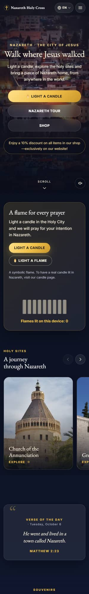

#### Holy site page (`/sites/<slug>`)

```
+-----------------------------------------------------------------+
| PlaceHero (tall, photo with Ken Burns zoom, focus per place)    |
|        ( < ALL HOLY SITES )  eyebrow link                       |
|             H1 Church of the Annunciation                        |
|     (View on Google Maps)(View the photos  [42])                 |
+-----------------------------------------------------------------+
| [ story eyebrow + H2 + PlaceStory text + PageTools ] | {VisitCard}|
|                                         (sticky, 340px, >= 900) |
+-----------------------------------------------------------------+
| #place-gallery   H2 + count + hint                              |
| [photo][photo][photo][photo]   masonry-like tiles, 2/3/4 columns |
| (a tile opens the Lightbox dialog)                              |
+-----------------------------------------------------------------+
| "More holy sites"  PlaceCards: photo cards of the other places  |
+-----------------------------------------------------------------+
```

The index (`/sites`) is a stack of large editorial cards, photo and text alternating sides (`<SiteList>`, 16 / 10
photos, `11fr / 9fr` from 900 px). A holy-site page on a phone, top 2600 px:

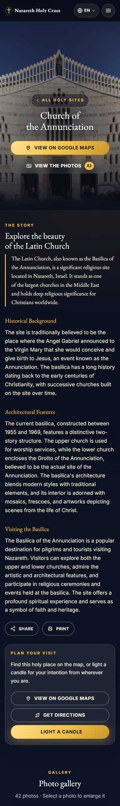

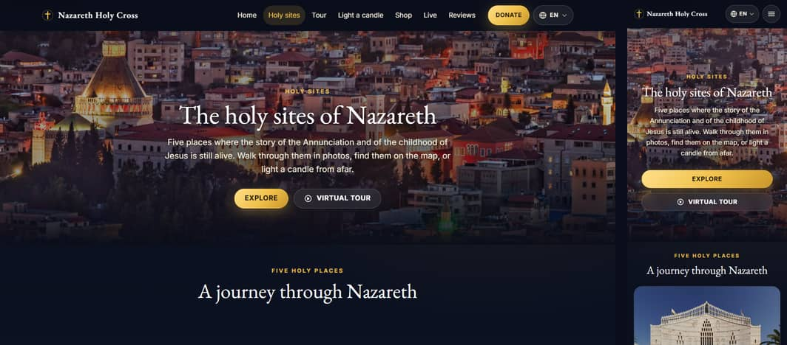

#### Shop list (`/shop`)

```
+-----------------------------------------------------------------+
| PageHero (photo, "Souvenirs from Nazareth")                     |
+-----------------------------------------------------------------+
| toolbar (sticky): [ search........ ] Sort [Featured v] (Wishlist)(Cart)
+-----------+-----------------------------------------------------+
| Filters   | Our favourites           ( < ) ( > )                |
| (sidebar  | [card][card][card][card]   ProductStrip              |
|  250px,   | ---------------------------------------------------  |
|  >= 1040) | All souvenirs  count        active-filter chips      |
| category  | [card][card][card]    2 columns, 3 from 700 px       |
| material  | [card][card][card]                                   |
| price     |        pagination / "show more"                      |
| rating    |                                                      |
| stock     |                                                      |
+-----------+-----------------------------------------------------+
Phone: the sidebar becomes a "Filters" button that opens a modal drawer.
```

State lives in the URL (`/shop?category=rosaries&sort=name`) so any view can be shared and Back steps through
filters. When the catalogue cannot be loaded the page shows `<StateCard>` with a retry button, never an empty grid.

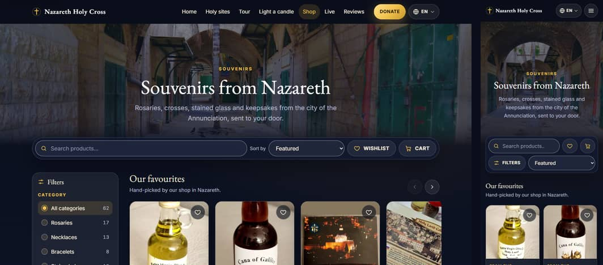

#### Product (`/shop/<id>`)

```
+-----------------------------------------------------------------+
| ( <- Continue shopping )                    (Wishlist)(Cart)    |
+------------------------------+----------------------------------+
| [ main photo, zoom button ]  | EYEBROW (category)               |
| [t][t][t][t] thumbnails      | H1 product name                  |
|  (sticky from 860 px)        | stars + "N reviews" link         |
|                              | $10.00  (gold)                   |
|                              | description                      |
|                              | colour / design chips            |
|                              | Quantity [- 1 +]  (Add to cart)  |
|                              | (Save to wishlist)(Share)        |
|                              | note: shipping is extra          |
+------------------------------+----------------------------------+
| #reviews: average + 5-to-1 breakdown, reviews, review form      |
| Similar products: ProductRow (2 columns phone, 4 wide)           |
| Recently viewed                                                  |
+-----------------------------------------------------------------+
```

Server-validated: the price shown is informational; the API decides every amount at checkout.

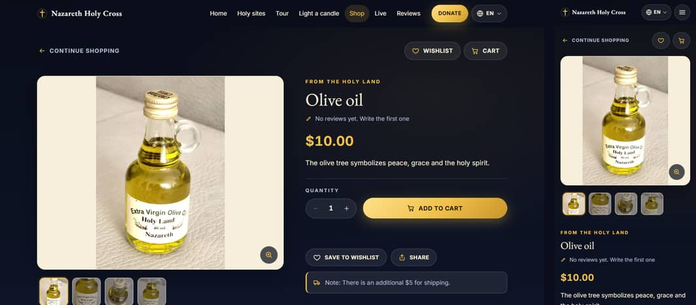

#### Cart and checkout (step flow)

```
/cart                                  /checkout (and /donate, /candle)
+------------------------+--------+    ( 1 Your details )-( 2 Payment )-( 3 Confirmation )
| {line: photo name qty  | {Summary|    +-----------------------------+------------------+
|   price  remove}       |  rows   |    | {form card}                 | {summary card,   |
| {line}                 |  total  |    |  H2 (focus target on step)  |  sticky >= 920}  |
|                        | (Checkout)|   |  fields, Notice on error   |  items, shipping,|
|                        | (Continue)|   |  (Continue to payment)     |  total           |
+------------------------+--------+    |                             |  PayPal buttons  |
                                       +-----------------------------+  (step 2)        |
                                                                      +------------------+
Phone: one column; the summary follows the form.
```

Three steps, always the same: **details** (a validated form, `noValidate` with our own messages), **payment**
(read-only recap of the details with a "Back" ghost button, PayPal buttons loaded lazily), **confirmation**
(`<DonePanel>`: gratitude, what was ordered, what happens next, a way home). The `<StepIndicator>` is an `<ol>`
whose current item has `aria-current="step"`. On every step change the focus moves to the card's heading
(`useStepFocus` in `web/src/components/checkout/hooks.ts`) and the block scrolls into view below the sticky header.
An empty cart shows a `.ui-glass` empty state with one gold button back to the shop.

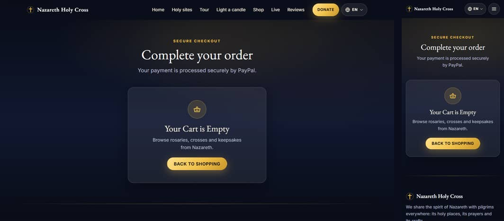

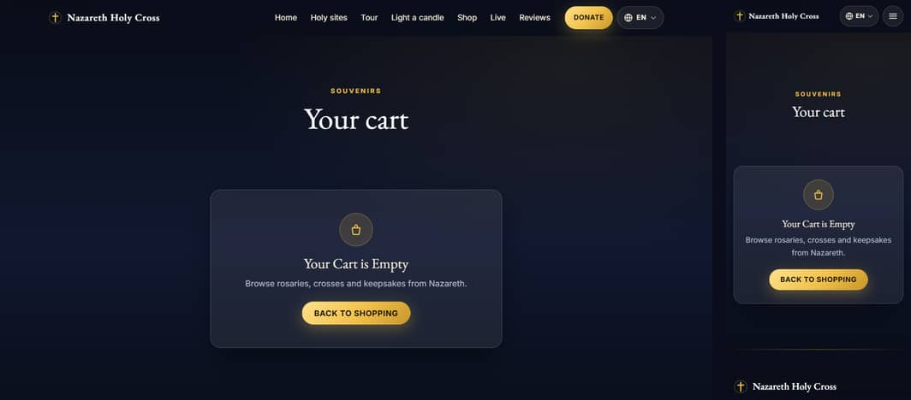

#### Candle (`/candle`)

```
+-----------------------------------------------------------------+
| PageHero (altar photo, "A flame for every prayer")              |
+-------------------------+---------------------------------------+
| (candle drawn in CSS)   | {card, overlaps the hero by 56px}      |
| H2 How to light a candle| ( 1 )-( 2 )-( 3 )  StepIndicator       |
| 1 Choose a church       | Select church:  [photo card][photo card]|
| 2 Write the intention   | First name | Last name                 |
| 3 Pay, we light it      | Email, repeat email, prayer (textarea) |
| (sticky >= 960 and      | price      (Continue to payment)       |
|  height >= 820)         | secure-payment note                    |
+-------------------------+---------------------------------------+
```

The prayer text is private and long: the textarea has a visible character limit, keeps what the visitor typed
when sending fails, and the confirmation page repeats the intention back with gratitude. The flame is decorative
(`aria-hidden`), still under reduced motion.

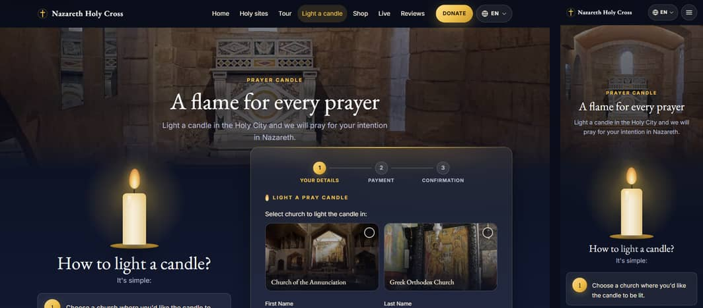

#### Donate (`/donate`)

A plain page (`shared.plain`): `PageHero` without a photo, then a single narrow gold-edged card: email field, amount
chips (presets and "Other" with a number input, 1 to 5000 USD), `Notice` on error, one large gold button, the secure
payment note, then the same recap and PayPal step and confirmation as checkout.

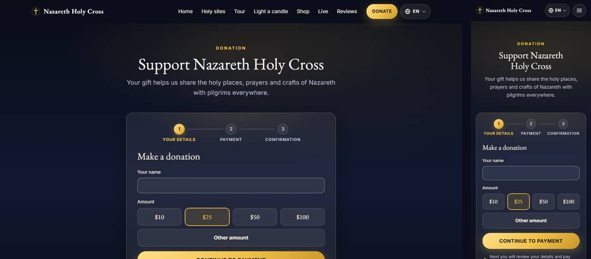

#### Content and legal page (`/privacy`, `/terms`, `/shipping-returns`, `/faq`)

```
+-----------------------------------------------------------------+
| PageHero (photo, title, lead)                                   |
+-----------------------------------------------------------------+
| .ui-container                                                   |
|   Last updated: 5 October 2026   (muted, formatted by Intl)      |
|   [ jump list: contents  (nav, aria-label) ]                    |
|   [ prose, max 68ch, H2 per section with an id (anchor target) ] |
|   [ related pages ]                                             |
+-----------------------------------------------------------------+
```

Legal pages are built by `<LegalDocument>` from `web/src/data/pilgrim/legal.ts` plus the per-language texts in
`pilgrim.legal`; the FAQ is `<FaqList>` (always open, linkable by anchor, indexable). Content pages print as
clean articles (`web/src/styles/print.css`).

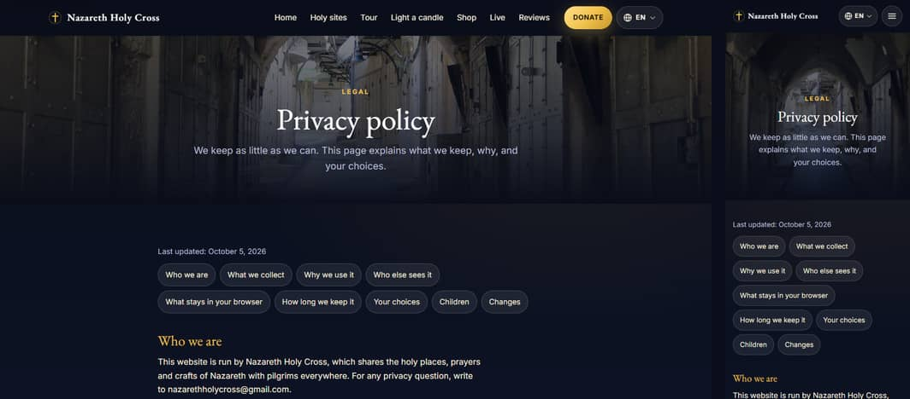

#### Form page (`/contact`; the same shape for prayers, reviews)

```
+-----------------------------------------------------------------+
| PageHero                                                        |
+-----------------------------------------------------------------+
| {form card, 1.3fr: H2, lead, fields, (Send)}  | {aside: direct   |
|   status line role=status / error role=alert  |  channels: (mail)|
|                                               |  (WhatsApp) ...} |
+-----------------------------------------------------------------+
```

Every form: labels above fields, errors beside the field and a summary `Notice`, `aria-invalid`, nothing lost on
failure, one submit per click (the button is `aria-busy` and ignores clicks while sending), sent / failed states
announced.

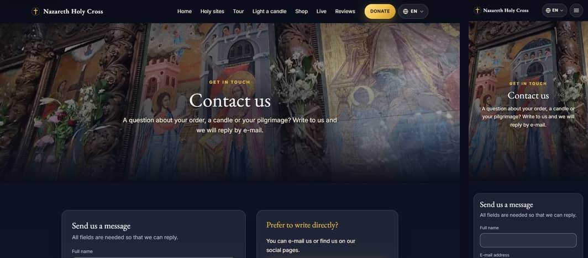

#### Search (`/search`)

`PageHero`, then a plain GET `<form role="search">` (a visually hidden label, `.ui-input`, a gold button) that works
without JavaScript, a `role="status"` result count, and results grouped by type (page, site, FAQ, gospel), each a
`.ui-glass` link. `Ctrl/Cmd + K` opens the same search as a palette dialog (`<SiteSearch>`, loaded lazily).

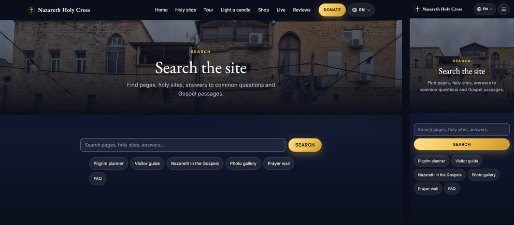

#### 404 and errors

```
+-----------------------------------------------------------------+
| basilica photo behind, dark                                     |
|                 404   (large outlined gold numeral, aria-hidden) |
|        H1 This page could not be found                          |
|        text   (Back to home)                                    |
+-----------------------------------------------------------------+
| WHERE WOULD YOU LIKE TO GO?                                     |
| {Holy sites ->} {Tour ->} {Light a candle ->}   3 interactive cards
+-----------------------------------------------------------------+
```

The 404 answers with a real HTTP 404 status and is `noindex`. `web/src/app/[locale]/error.tsx` has the same
family look (heading focused, "Try again" and "Back to home", an error reference); `web/src/app/global-error.tsx` is
the last resort when even the layout fails and carries its own texts in all languages. A failing section on a page
(reviews, products) shows a small `.ui-state--error` panel with a retry, and the rest of the page still renders.

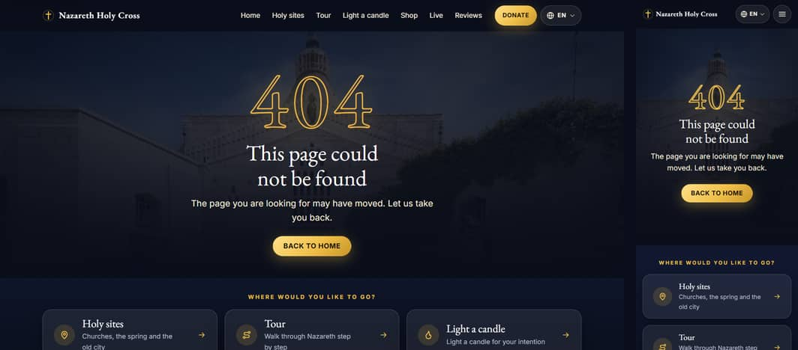

## 5. Component catalogue

Rules for the whole catalogue: every component uses tokens only, logical properties only, and messages only; every
interactive component has hover, `:active`, `:focus-visible`, disabled, reduced-motion and right-to-left behaviour;
every pressable thing is at least `--tap` (44px) tall and wide. Reuse before you write another copy.

### 5.1 Global classes (`web/src/styles/ui.css`, `web/src/styles/globals.css`)

| Class | Purpose and anatomy | Notes |
|---|---|---|
| `.ui-page` | Page root: night gradient plus glow background, cream text, `overflow-x: clip`, `padding-bottom: 72px` | One per page. Add the page module class beside it |
| `.ui-container` | Width-limited, centred content column | See 4.2 |
| `.ui-section` | Vertical rhythm of a section | Wrap each section in it, with `aria-labelledby` |
| `.ui-hero` | Page header band with a photo behind a scrim (`.ui-hero__bg`, `::after` scrim) | Prefer `<PageHero>` |
| `.ui-hero__bg` | The photo of the hero, `object-fit: cover`, behind (`z-index: -2`) | |
| `.ui-hero__title` | The page's `<h1>` | One per page |
| `.ui-hero__lead` | Intro under the title, `max-width: 640px`, cream with a dark halo (it sits on a photograph; the hero's eyebrow gets the same halo) | Muted text on a photo fell under 4.5:1 (`docs/ACCESSIBILITY.md`) |
| `.ui-hero__action` | Spacing for a button under the lead | |
| `.ui-eyebrow` | Small gold uppercase label above a title | In Hebrew and Arabic: no letter-spacing |
| `.ui-h2`, `.ui-h3` | Section and sub-section headings | Use the heading element that fits the outline; the class only styles |
| `.ui-muted` | Secondary text colour | |
| `.ui-prose` | Reading text block, 68ch, children spaced `--space-4` | |
| `.ui-link` | Underlined gold text link, thicker underline on hover | For links inside text |
| `.ui-ltr` | Keeps Latin names, numbers, e-mail addresses left to right inside Hebrew and Arabic text (`direction: ltr; unicode-bidi: isolate`) | |
| `.ui-btn` | The button. Variants below | A link styled as a button keeps `<a>` |
| `.ui-card` | Padding of a card (`clamp(18px, 3vw, 28px)`) | Combine with `.ui-glass` |
| `.ui-card--interactive` | A card that is a link: lifts 4px and gains a gold edge on hover | `:hover` lift only where hover exists |
| `.ui-grid` | Auto-fill grid of cards | |
| `.ui-elev-1`, `.ui-elev-2`, `.ui-elev-3`, `.ui-elev-4` | Shadow helpers | |
| `.ui-tools` | A row of small secondary actions under an article (share, print) | |
| `.ui-badge` | Small gold pill label | |
| `.ui-divider` | A horizontal rule with fading ends; put an icon between if wanted | |
| `.ui-icon` | Sizing of an inline icon (`--icon-size`, default 1.25em) | |
| `.ui-flip-rtl` | Mirrors an element in right-to-left | |
| `.ui-field`, `.ui-label`, `.ui-hint` | Form field wrapper, label, hint | See 5.3 |
| `.ui-input`, `.ui-select`, `.ui-textarea` | Text controls: 46px min height, 16px type, `--field-line` border | |
| `.ui-error`, `.ui-success` | Message colours | Always with an icon or words |
| `.ui-state`, `.ui-state__title`, `.ui-state__text`, `.ui-state--error` | Panel for empty, error and info states | `role="status"` or `role="alert"` |
| `.ui-alert`, `.ui-alert--error`, `.ui-alert--success` | Inline message strip | |
| `.ui-spinner` | Small rotating ring, inside a button or state | |
| `.ui-reveal`, `.is-in` | Scroll reveal states (see `<Reveal>`) | |
| `.ui-skeleton` | Shimmering placeholder | Shaped like the real content |
| `.skip-link` | First tab stop, jumps to `#main`; visible only when focused | In `SiteHeader` |
| `.visually-hidden` | Text for screen readers only | Use for "(opens in a new tab)", labels of icon-only content |

#### Button `.ui-btn`


Anatomy: a pill (`border-radius: 999px`), `min-height: var(--tap)`, an optional icon and a label (gap 10px).
Variants: `.ui-btn--gold` (the one primary action of a view), `.ui-btn--ghost` (secondary), `.ui-btn--glass`
(over photographs), sizes `.ui-btn--sm` (smaller type and padding, still 44px tall) and `.ui-btn--lg` (52px),
`.ui-btn--icon` (round, icon only, **always** with an `aria-label`).
States: hover lifts 2px (only where hover exists), `:active` presses (scale .98), `:focus-visible` shows the
ring (cream on the gold variant), `:disabled` and `[aria-disabled='true']` dim to 50%, `[aria-busy='true']` shows the
progress cursor and ignores clicks (put a `.ui-spinner` inside).
Do: one gold button per view; a verb label; `<a>` for navigation and `<button>` for actions.
Don't: two gold buttons side by side; a button with only an icon and no `aria-label`; a disabled gold button
without saying why nearby; a custom pill with your own colours.
RTL: no change needed (flex, logical). Hebrew and Arabic labels are not uppercased and have no letter-spacing.

```tsx
<Link href="/candle" className="ui-btn ui-btn--gold">
  <Flame size="sm" />
  {t('heroSection.lightCandle')}
</Link>
<button type="button" className="ui-btn ui-btn--glass ui-btn--icon" aria-label={t('ux.backToTop')}>
  <ArrowUpIcon size={20} />
</button>
```

#### Surfaces: `.ui-glass`, `.ui-card`, `.ui-card--interactive`


`.ui-glass` is the standard card: `--glass` fill, `--glass-line` border, `--radius`, `backdrop-filter: blur(14px)`,
`--shadow`. `.ui-card` adds padding. A card that is one link also has `.ui-card--interactive` and the `<a>` is the
card (one tab stop, a visible focus ring on the whole card). Never nest an interactive element inside a card-link
(the wishlist heart on a product card sits next to the link, not inside it).
Do: put text on glass only over the night background or a scrim. Don't: stack three glass layers (the blur is
expensive on phones) and don't give glass cards a different radius.

#### Forms


```tsx
<div className="ui-field">
  <label className="ui-label" htmlFor="email">{t('form.email')}</label>
  <input id="email" className="ui-input" type="email" autoComplete="email" dir="ltr"
         aria-invalid={error ? true : undefined} aria-describedby={error ? 'email-error' : undefined} />
  {error && <p id="email-error" className="ui-error">{error}</p>}
</div>
```

Anatomy: `.ui-field` (grid, 6px gap) > `.ui-label` + control + `.ui-hint` / `.ui-error`. Controls are 46px tall with
16px type. Focus: gold border and a soft gold halo, plus a 2px gold outline for keyboard focus; in forced-colors a
3px `Highlight` outline. Invalid: `aria-invalid="true"` turns the border `--danger`; the message is linked with
`aria-describedby`. Disabled: 55% opacity, `not-allowed` cursor. E-mail, phone and postal fields are `dir="ltr"`
and align to the end in right-to-left pages (`:root[dir='rtl'] .ui-input[dir='ltr']`). Use the checkout helpers
`<Field>` and `<TextField>` (`web/src/components/checkout/Field.tsx`) where possible: they wire the error and
`aria-describedby` for you.
Do: the right `type`, `inputmode` and `autocomplete`; accept pasted digits in any keyboard layout (the phone check
accepts Arabic-Indic digits and sends 0-9). Don't: placeholder as label; validate on every keystroke before the
visitor has left the field (check on blur and on submit, then re-check while fixing); lose typed text on error.

#### States: empty, error, loading


`.ui-state` (+ `.ui-state--error`) is a centred dashed (solid for error) panel with an icon, a title
(`.ui-state__title`, serif), text (`.ui-state__text`) and one action. Give it `role="status"` or `role="alert"`.
`.ui-alert` is the inline strip for a message inside a form or card. `.ui-spinner` goes inside a button or state.
`.ui-skeleton` shimmers (static under reduced motion) and is shaped like the real content so nothing jumps; the
shop has full skeleton sets (`web/src/components/shop/Skeletons.tsx`). Shop pages use `<StateCard>`
(`web/src/components/shop/StateCard.tsx`) for the same job. A page's branded loading screen is `<LoadingScreen>`.

### 5.2 Shared React components (`web/src/components/ui`, `layout`, `media`)

| Component | Purpose | Props and behaviour | A11y and RTL |
|---|---|---|---|
| `<PageHero>` `web/src/components/ui/PageHero.tsx` | Page header: photo, eyebrow, `<h1>`, lead, optional children | `title`, `eyebrow`, `lead`, `media` (a licensed photo, preferred) or `image` + `imageAlt` (legacy), `children` (buttons) | Photo is decorative (`alt=""`) unless `imageAlt`; one `<h1>` |
| `<PlaceHero>` `web/src/components/places/PlaceHero.tsx` | Tall photo header of a holy site with Ken Burns zoom | `image`, `title`, `eyebrow`, `eyebrowHref`, `lead`, `focus` (object-position), `size` (`tall` or `medium`), `children` | The back chevron mirrors; zoom off for reduced motion |
| `<MediaPicture>` `web/src/components/media/MediaPicture.tsx` | Licensed photo as `<picture>` AVIF/WebP with blur placeholder and focal crop | `item`, `alt`, `sizes`, `priority`, `lean`, `fill`, `className` | `alt` from messages; `priority` once per page |
| `<Reveal>` `web/src/components/ui/Reveal.tsx` | Fade-and-rise once when scrolled into view | `as`, `className`, `delay` (ms), children | Shows at once without `IntersectionObserver`, under reduced motion, and with JavaScript off (`@media (scripting: none)`) |
| `<ToastProvider>` `web/src/components/ui/Toast.tsx` | Toasts: the provider and the `useToast()` hook; `toast.show({ message, kind, duration })` | `kind`: `success`, `error`, `info`. Max 3 visible, same message not repeated, pause on hover and focus, 44px close button. Errors stay 7s, others 4.5s | Polite live region always in the page; errors `role="alert"`; silent no-op without a provider |
| `<Notice>` `web/src/components/ui/Notice.tsx` | Boxed message with icon: form-level and payment errors | `tone` (`danger`, `info`), `role` (`alert`, `status`, none) | `alert` announces at once |
| `<PageTools>` `web/src/components/ui/PageTools.tsx` | "Share" (phone share sheet or copy link) and "Print" | `title`, `print` | Reports with a toast; hidden in print (`data-print="hide"`) |
| `<Stars>` `web/src/components/ui/Stars.tsx` | Read-only rating drawn with SVG | `value` (0-5), `label` (spoken), `size`, `count`, `countLabel` | `role="img"` with the spoken label; no font dependence |
| `<Flame>` `web/src/components/ui/Flame.tsx` | Decorative candle flame in CSS | `size` (`sm`, `md`, `lg`), `ink` (for use on gold) | `aria-hidden`; still under reduced motion |
| `<LoadingScreen>` `web/src/components/ui/LoadingScreen.tsx` | Cross mark with a slow gold halo, "Loading..." | none | `role="status"`; fades in after 250ms so quick pages never flash it |
| `<JsonLd>` `web/src/components/ui/JsonLd.tsx` | Structured data script | `data` built with `web/src/lib/jsonLd.ts` | The only allowed `dangerouslySetInnerHTML` (escaped) |
| `<SvgIcon>`, icons `web/src/components/ui/icons.tsx` | The icon set (3.6) | `size`, `flip` on directional icons | Decorative |
| `<SiteHeader>` `web/src/components/layout/SiteHeader.tsx` | Sticky frosted header: brand, nav, Donate, accessibility settings, language menu, drawer | Reads `mainNav` from `web/src/lib/site.ts` | Skip link first; drawer returns focus; `aria-current="page"` |
| `<A11yPanel>` `web/src/components/layout/A11yPanel.tsx` | The accessibility settings: a round button in the header that opens a small non-modal dialog (section 5.5) | `onOpen` (the header closes its drawer) | `aria-expanded`, `aria-controls`, `aria-haspopup="dialog"`; real radio buttons and switches; Escape and the close button return the focus |
| `<MotionToggle>` `web/src/components/ui/MotionToggle.tsx` | Pause / play button for a moving background (WCAG 2.2.2) | `className`; pauses the CSS animations inside the nearest `data-motion-scope` element and tells `<HeroVideo>` | The label follows the state (`ux.motion.pause`, `ux.motion.play`); not shown when the visitor asked for less motion |
| `<LanguageSwitcher>` `web/src/components/layout/LanguageSwitcher.tsx` | Menu of all 14 languages, each in its own script, two columns | Real links with `hreflang` | Arrow keys mirror in RTL; Escape returns focus |
| `<SiteFooter>` `web/src/components/layout/SiteFooter.tsx` | Four quiet columns plus languages; no newsletter, no cookie banner | Reads `footerNav`, `pilgrimNav`, `legalNav`, `socialLinks` | Social buttons 44px; the copyright line is one LTR unit |
| `<BackToTop>` `web/src/components/layout/BackToTop.tsx` | Round button after 1.4 screens of scrolling | none | Out of the tab order while hidden; hands focus to `<main>` |
| `<ReadingProgress>` `web/src/components/layout/ReadingProgress.tsx` | 3px gold line, fills as the visitor reads | long pages only | Decorative; grows from the start edge; hidden in print |
| `<RouteFocus>` `web/src/components/layout/RouteFocus.tsx` | Moves focus to `<main>` after client navigation | none | Keyboard and screen-reader users start at the new page |
| `<PageTransitions>` `web/src/components/layout/PageTransitions.tsx` | View Transitions on link clicks; shows `<LoadingScreen>` when a navigation takes over 0.9s | none | Off for reduced motion, back/forward and the language menu |
| `<CurrencyNote>` `web/src/components/intl/CurrencyNote.tsx` | Approximate amount in the visitor's currency under a total | `amountUsd`, `shipping` (adds the flat shipping line) | Always labelled approximate |

### 5.3 Feature components

| Area | Components (all under `web/src/components/`) | Notes |
|---|---|---|
| Home | `<HomeHero>`, `<HeroVideo>`, `<SoundToggle>`, `<CandleStrip>`, `<SitesCarousel>`, `<VerseOfDay>`, `<Souvenirs>`, `<Voices>`, `<Story>`, `<StickyCta>` in `web/src/components/home/` | Sections render on the server; each is left out or replaced by a friendly note when its data cannot be loaded. The carousel works with touch, mouse drag, arrow buttons and keyboard (arrows, Home, End) in both directions |
| Holy sites | `<SiteList>`, `<PlaceCards>`, `<PlaceStory>`, `<VisitCard>`, `<PlaceGallery>`, `<Lightbox>`, `<PhotoImage>`, `<ExternalLink>` in `web/src/components/places/` | The `<Lightbox>` is a native modal `<dialog>` (focus trapped, Escape closes, arrows and swipes change photo, mirrored in RTL, focus returns to the tile). Its code loads on the first click |
| Shop | `<ShopBrowser>`, `<FilterPanel>`, `<FilterDrawer>`, `<ProductCard>`, `<ProductStrip>`, `<ProductRow>`, `<ProductDetail>`, `<ImageZoom>`, `<QuantityStepper>`, `<CartView>`, `<CartPill>`, `<WishlistButton>`, `<WishlistLink>`, `<WishlistView>`, `<ShareButton>`, `<ProductReviews>`, `<ProductReviewForm>`, `<RecentlyViewed>`, `<RetryButton>`, `<StateCard>`, `<GridSkeleton>`, `<ProductSkeleton>`, `<CartSkeleton>`, `<ShopBarSkeleton>` in `web/src/components/shop/` | State in the URL; the heart is a toggle with `aria-pressed` and a polite status line; a stepper button at its limit is `aria-disabled` (focus stays); cart and wishlist live in `localStorage` and are validated on read |
| Checkout and payments | `<StepIndicator>`, `<Field>`, `<TextField>`, `<DonePanel>`, `<PayPalPanel>`, `<LazyPayPalPanel>` in `web/src/components/checkout/` | PayPal loads lazily at the payment step; the server decides every amount; the PayPal SDK gets the CSP nonce (`useCspNonce`) |
| Community | `<LivePlayer>`, `<PastBroadcasts>`, `<ReviewForm>`, `<ReviewWall>` in `web/src/components/community/` | The player's Live, Upcoming and Offline state follows the visitor's clock each second; recordings use `preload="none"` |
| Pilgrim guides | `<ContactForm>`, `<PrayerForm>`, `<LikeButton>`, `<FaqList>`, `<GalleryBrowser>`, `<LegalDocument>`, `<NextSteps>`, `<Planner>`, `<WalkingTable>` in `web/src/components/pilgrim/` | The planner keeps its answers in the URL, can print and export an iCalendar file made in the browser; the "Amen" counter is optimistic and corrects itself; one Amen per prayer per browser |
| Search | `<SiteSearch>`, `<LazySiteSearch>`, `<SearchButton>` in `web/src/components/search/` | The palette code is fetched only on `Ctrl/Cmd + K` or the footer button |

For every one of them the rule is the same: read the file's top comment and its test before changing behaviour;
the comment records the decision (why a native `<dialog>`, why `aria-disabled` and not `disabled`).

### 5.4 Toasts, dialogs, drawers: when to use which

| Need | Use | Not |
|---|---|---|
| Confirm something quick that happened ("Link copied") | `toast.show({ message, kind: 'success' })` | A modal |
| A failed action the visitor can retry | `toast.show({ kind: 'error' })` for one-off actions; `<Notice role="alert">` for a form | A silent failure |
| A choice that needs the whole page (photo viewer, filters on a phone) | A native `<dialog>` opened with `showModal()` | A hand-rolled overlay with a focus trap |
| A destructive confirmation | Admin only: `confirm()` of the feedback provider (11.4) | Public pages have no destructive actions |

### 5.5 The accessibility panel

Every page has a round button with the accessibility sign in the header, between the Donate button and the language
menu (`<A11yPanel>`, label `ux.a11y.open`, the other texts in `ux.a11y`). It opens a small non-modal dialog below
the header at the reading end (mirrored in Hebrew and Arabic; nearly as wide as the screen on a phone, scrolling
inside itself) with:

| Control | What it does | Attribute on `<html>` | CSS |
|---|---|---|---|
| Text size: 100, 125, 150, 175, 200% (radio buttons in a `fieldset`) | Root font size; every font size is in rem, so all text scales (WCAG 1.4.4). The header switches to its drawer and grows a little (`--header-h`) | `data-a11y-text` = `125` ... `200` | `web/src/styles/globals.css`, `web/src/components/layout/SiteHeader.module.css` |
| High contrast | Redefines the colour tokens (section 3.2) | `data-a11y-contrast="high"` | `web/src/styles/tokens.css` |
| Underline links | Every `a[href]` underlined | `data-a11y-links="underline"` | `web/src/styles/globals.css` |
| Stop animations | Animations and transitions jump to their end, the hero film is not started, page transitions and smooth scrolling are off; `prefersReducedMotion()` in `web/src/lib/motion.ts` reports it too. The system setting `prefers-reduced-motion` is always honoured as well, and the panel says so | `data-a11y-motion="reduce"` | `web/src/styles/globals.css` |
| Readable font | `--serif` becomes `--sans`: one plain typeface per script, no italics | `data-a11y-font="readable"` | `web/src/styles/tokens.css`, `web/src/styles/globals.css` |
| More text spacing | The WCAG 1.4.12 values: line height 1.8, words 0.16em, paragraphs apart; letters 0.12em except in Hebrew and Arabic | `data-a11y-spacing="wide"` | `web/src/styles/globals.css` |
| Strong focus ring | 4px gold ring with a dark gap and a cream halo | `data-a11y-focus="strong"` | `web/src/styles/globals.css` |
| Large pointer | 48px cursors from `web/public/images/cursors` | `data-a11y-cursor="large"` | `web/src/styles/globals.css` |
| Reset | Back to the defaults (announced in a `role="status"` line) | none | |
| Accessibility statement | Link to `/accessibility` | | |

Rules:

- **Storage and first paint.** The settings live in `localStorage` under `nhc.a11y.v1` (`web/src/lib/a11y.ts`):
  validated on read, wrapped in `try/catch`, kept in memory when storage is blocked, synchronised between tabs. A
  tiny ES5 script in the `<head>` of `web/src/app/[locale]/layout.tsx` (`A11Y_PREPAINT`) carries the request's CSP
  nonce and sets the attributes before anything is drawn, so large text or high contrast never flashes in. The unit
  test runs that script against the TypeScript functions so the two cannot drift. No cookie, nothing sent anywhere.
- **Styling a new component for the modes.** Use tokens (high contrast then works by itself), rem font sizes (text
  size works by itself), no fixed heights on text, no `text-overflow: ellipsis` or line clamp on content that has
  no other place to be read (product, cart and photo names wrap instead: `<ProductCard>`, the checkout summary,
  `<Lightbox>`), and a `prefers-reduced-motion` branch for any animation (the stop-animations mode covers the rest).
- **Moving backgrounds** get a `<MotionToggle>` inside an element marked `data-motion-scope` (the home hero and
  `<PlaceHero>` have one): it pauses the CSS animations in the scope (`[data-motion-paused]` in
  `web/src/styles/globals.css`) and the hero film.
- **No overlay widget.** Do not add a third-party "accessibility overlay" script: it would break the CSP, add a
  tracker-like dependency and does not make a site conform. The panel is plain CSS on tokens.
- Tests: `web/tests/unit/a11y.test.tsx` (storage, attributes, the pre-paint script, the dialog's keyboard
  behaviour, the high-contrast colours) and `web/tests/e2e/a11y.spec.ts` (axe on every page with and without the
  modes, the panel with the keyboard, persistence under the CSP, the pause buttons, the header in 14 languages,
  focus not obscured). The audit and its results are in `docs/ACCESSIBILITY.md`.

## 6. Interaction and motion

**Principle.** Motion is slow, small and optional. One loop only: the loading halo and the Ken Burns zoom on hero
photographs (both removed for reduced motion). Everything else plays once and then stops.

| Pattern | Spec |
|---|---|
| Reveal on scroll | `.ui-reveal`: opacity 0 and 28px down to rest in 0.8s with `--ease-out`, once, when 8% is visible (`threshold: 0.08`, `rootMargin: 0px 0px -40px 0px`). Hero text uses movement only, so text is never invisible at first paint |
| Hover | Buttons lift 2px, cards lift 4px and gain a gold edge, 250ms. Not applied where `(hover: none)` |
| Press | `:active` scale .98 |
| Page change | View Transitions API on link clicks: the old page is held up to 700ms while Next loads the next, then fades 140ms while the new one fades in and rises 10px (`html.vt-page main`, `::view-transition-*(page)` at the end of `web/src/styles/globals.css`). Browsers without the API, reduced-motion visitors, back/forward and the language menu navigate instantly |
| Slow navigation | After 0.9s `<LoadingScreen>` covers the old page under the header (the menu stays usable) with `role="status"` |
| Loading content | Skeletons shaped like the content; a page's own `loading.tsx` is **not** used on locale pages (see 13) |
| Toasts | Bottom centre above sticky actions, polite live region, 4.5s (errors 7s), pause on hover/focus |
| Drawers and dialogs | Native `<dialog>`: opens modal, page behind inert, Escape closes, focus returns to the opener |
| Focus management | Skip link first; after client navigation `<RouteFocus>` focuses `<main>`; after a step change the card heading is focused (`useStepFocus`); menus return focus to their button; a hidden control is out of the tab order |
| Smooth scroll | `scroll-behavior: smooth` on `html`, `auto` under reduced motion; programmatic scrolls use `scrollBehavior()` from `web/src/lib/motion.ts` |
| Reduced motion | Every animation has a `prefers-reduced-motion: reduce` branch that removes it; test with the emulation (the Playwright test `ux.spec.ts` does). The panel's "Stop animations" (5.5) does the same for visitors who cannot change their system setting |
| Pause | A background that keeps moving (the home hero film and Ken Burns zoom, the holy-site Ken Burns) has a `<MotionToggle>` pause button in its bottom corner at the reading end (WCAG 2.2.2) |


Rules: durations come from the tokens (`--dur-fast`, `--dur-base`, `--dur-slow`); easing from `--ease-out`;
animate `transform` and `opacity` only (never layout properties); nothing moves faster than 150ms or slower
than 1s except the 24s Ken Burns; never autoplay audio; JavaScript reads the preference through
`prefersReducedMotion()` in `web/src/lib/motion.ts`.

## 7. Accessibility checklist

Target: WCAG 2.2 level AA on every page, in every language. What is automated: axe-core with the tags `wcag2a`,
`wcag2aa`, `wcag21a`, `wcag21aa`, `wcag22aa` on every page in English, Hebrew and Arabic at desktop and phone width,
plain and with every mode of the accessibility panel on (`web/tests/e2e/a11y.spec.ts`), plus `best-practice` on the
main pages and in the interactive states (`web/tests/qa/axe.mjs`, `web/tests/e2e/shell.spec.ts`,
`web/tests/e2e/qa-site.spec.ts`; the admin in `admin/tests/e2e/`). The checks axe cannot make (text on photographs,
focus not obscured, text spacing) are run by `web/tests/qa/a11y-probe.mjs`; results and known gaps are in
`docs/ACCESSIBILITY.md`, and the public statement is `/accessibility`. What is **not** verified: real screen readers
(NVDA, VoiceOver, TalkBack), real devices, and Firefox and Safari engines. Axe finds roughly a third of the
problems; the checklist below is the rest.

Check every item for each new page or component:

**Structure and names**
- [ ] One `<h1>`; headings descend without skipping levels; sections use `aria-labelledby`.
- [ ] Landmarks: `<header>`, `<nav aria-label>`, `<main id="main">`, `<footer>`; a second `<nav>` has its own label.
- [ ] `<html lang>` and `dir` come from the URL (done by the layout). A phrase in another language gets its own
      `lang` attribute (language names in the language menu are written in their own script).
- [ ] Every control has an accessible name from messages. Icon-only buttons have `aria-label`. A link says where it
      goes; an external link adds the visually hidden "(opens in a new tab)".
- [ ] Every image has `alt` (descriptive, or `alt=""` when decorative). Every icon is `aria-hidden`.
- [ ] Lists are `<ul>` / `<ol>`; data tables have `<th scope>` and a caption (in the admin, a visually hidden one).

**Keyboard**
- [ ] Everything works with the keyboard alone, in a logical order that matches the visual order (also in RTL).
- [ ] The skip link is the first tab stop and moves focus to `<main>`.
- [ ] The focus ring (`--focus-ring`, 3px gold, offset 3px) is visible on every focusable element and never removed.
      On a gold button the ring is cream (`.ui-btn--gold:focus-visible`).
- [ ] Focus is never hidden behind the sticky header (2.4.11): `scroll-padding-top` handles it; do not add your own.
- [ ] Menus and dialogs: Escape closes, focus returns to the opener, focus is trapped in modals (native `<dialog>`).
- [ ] A hidden control is out of the tab order (`hidden`, `inert`, `visibility`), e.g. the closed drawer, the
      back-to-top button.
- [ ] Custom widgets follow the ARIA pattern: radio groups are real `<input type="radio">` in a `<fieldset>`;
      carousels and the language menu use arrow keys, Home and End, mirrored in RTL.
- [ ] No keyboard trap, no focus loss after an update (after removing a wishlist item focus moves to the next
      remove button or the empty state).

**Pointer and touch**
- [ ] Targets are at least 44 by 44 px (`--tap`; WCAG 2.2 asks 24). `ux.spec.ts` asserts it for header and footer.
- [ ] No action needs a drag, a long press or a multi-finger gesture; the carousel has buttons as well as swiping.
- [ ] Hover-only styles are inside `@media (hover: hover)` or harmless without hover; a tooltip is also reachable by
      focus and does not hide content (1.4.13).

**Colour, text and zoom**
- [ ] Text contrast 4.5:1 (3:1 for large text); UI parts and focus rings 3:1. Use only the pairs in 3.2.
- [ ] No information by colour alone.
- [ ] Reflow at 320 px wide and at 400% zoom with no horizontal scroll; text can be resized to 200%; text spacing
      overrides (1.4.12) do not clip. Never set fixed heights on text containers.
- [ ] Body text is at least 16px; never a font-size in `px` below 12px.
- [ ] `prefers-reduced-motion: reduce` removes every animation (section 6).
- [ ] The page still works with every accessibility panel mode on (5.5): 200% text without sideways scroll, high
      contrast without invisible parts, nothing cut off with the wider spacing.
- [ ] Forced colours (Windows high contrast): state that relies on a background (current page, selected, pressed) has
      a system-colour outline (`@media (forced-colors: active)` in `web/src/styles/globals.css`); focused fields get a
      real outline because `box-shadow` is dropped.

**Forms and feedback**
- [ ] Visible labels; `autocomplete` tokens for name, email, tel, address (1.3.5); the right `inputmode`.
- [ ] Errors: identified in text, linked with `aria-describedby`, `aria-invalid="true"`, summarized by a
      `role="alert"` notice, focus moved to the first invalid field on submit.
- [ ] Status messages (saved, copied, added to cart) use `role="status"` or a polite live region (4.1.3); errors
      use `role="alert"`.
- [ ] Do not make the visitor enter the same information twice in one flow (3.3.7), except where re-entry is
      essential (the candle form asks for the e-mail twice to catch typos).
- [ ] Authentication (admin) allows paste and password managers, has a show/hide button, never blocks with a
      cognitive test (3.3.8).
- [ ] Nothing times out silently; a session that ends says so (admin: idle warning dialog with a countdown).

**Media**
- [ ] Autoplaying motion that lasts more than five seconds can be stopped (2.2.2): the home hero film and the Ken
      Burns zooms have a `<MotionToggle>` pause button, and the accessibility panel can stop all motion. If you add
      moving content, put it in a `data-motion-scope` with a `<MotionToggle>`.
- [ ] Videos with speech have captions and a transcript (1.2.2). Known gap: none of the site's videos has captions yet.
- [ ] No flashing content.

**Print and assistive reading**
- [ ] A content page prints as a clean article (`web/src/styles/print.css`), external links print their address.

## 8. Right-to-left and international rules

Hebrew (`he`) and Arabic (`ar`) mirror the whole site from one stylesheet; there is no second CSS file.

### 8.1 Logical properties only

`web/tests/unit/conventions.test.ts` rejects `left`, `right`, `margin-left`, `padding-right`, `border-left`,
`text-align: left` and the like in any stylesheet. Use:

| Instead of | Write |
|---|---|
| `margin-left` / `margin-right` | `margin-inline-start` / `margin-inline-end` (or `margin-inline`) |
| `padding-left` / `padding-right` | `padding-inline-start` / `padding-inline-end` |
| `left` / `right` | `inset-inline-start` / `inset-inline-end` (`inset-inline: 0`) |
| `top` / `bottom` (block axis, when needed) | `inset-block-start` / `inset-block-end` |
| `text-align: left` | `text-align: start` (`end` for the opposite) |
| `border-left` | `border-inline-start` |
| `float: left` | avoid; use flex or grid |
| `width` / `height` of a fill | `inline-size` / `block-size` where it follows the text direction |

Gradients and transforms are **not** mirrored by the browser: a `linear-gradient(90deg, ...)` or a `translateX()`
that has a direction needs a `[dir='rtl']` override or a flipped twin (see `.ui-divider::after`, the reading-progress
bar's `transform-origin`). `:root[dir='rtl'] .ui-flip-rtl` mirrors an element.

### 8.2 What flips and what does not

| Flips (points along reading direction) | Does not flip |
|---|---|
| Next/previous arrows and chevrons, "back" arrows (`ArrowEndIcon flip`, `ChevronStartIcon`), carousel buttons | The brand cross, play/pause and media controls, check marks, search magnifier, clocks, phone and e-mail icons, social logos |
| Progress bars and fills (start edge) | Numbers, prices and dates (always left to right as a unit) |
| Hover nudges of arrows, slide-in drawers (they enter from the end edge) | The order of the digits of a phone number |
| Keyboard arrows in carousels and menus (Left and Right swap) | Page up/down, Home and End |

Carousel scroll maths use `Math.abs(scrollLeft)` (browsers report negative values in RTL): see
`web/src/components/home/SitesCarousel.tsx`.

### 8.3 Bidirectional text

- Wrap Latin names, e-mail addresses, phone numbers, order numbers and prices inside Hebrew or Arabic sentences in
  `<bdi>`, give them `dir="ltr"`, or use `.ui-ltr` (`direction: ltr; unicode-bidi: isolate`). The admin uses
  `<Ltr>` and `.ltr`.
- Use `dir="auto"` on user-entered text whose direction is unknown (reviews, prayers).
- "Nazareth Holy Cross" stays Latin inside RTL text; Hebrew prefixes attach with a maqaf (glossary).
- E-mail, phone and postal fields are `dir="ltr"` and align to the end in RTL (the CSS rule is in `ui.css`).
- Never insert a bidi control character by hand into a message (the unit tests reject invisible characters).

### 8.4 Fonts, line-breaking, numbers

- Fonts per script: 3.3. Hebrew and Arabic use the taller `--leading-body: 1.8`.
- No letter-spacing and no uppercase in Hebrew and Arabic (it breaks Arabic joining); buttons and eyebrows reset them.
- Hyphenation: automatic by `<html lang>` for Latin, Cyrillic and Greek text; `hyphens: manual` for Hebrew and
  Arabic. Headings use `text-wrap: balance`, paragraphs `text-wrap: pretty`. Long words may always break
  (`overflow-wrap: break-word`) rather than push the page sideways.
- Western digits in every language (`numberingSystem: 'latn'`); use `Intl` for prices, dates and plurals; never
  format by hand. Currency symbol position follows the locale automatically through `Intl`.
- Allow 30-40% more text than English (German, Russian, Ukrainian, Greek): buttons wrap or grow, never clip.

### 8.5 How to test

Open every new page at 390 px and at 1366 px in `/he` and `/ar` (mirrored), and in `/de` or `/ru` (long words);
look for: icons pointing the wrong way, text touching an edge, e-mail or numbers in the wrong order, clipped
buttons, a carousel starting at the wrong end, a drawer entering from the wrong side. The checklist is also in
`docs/DESIGN.md` section 5.

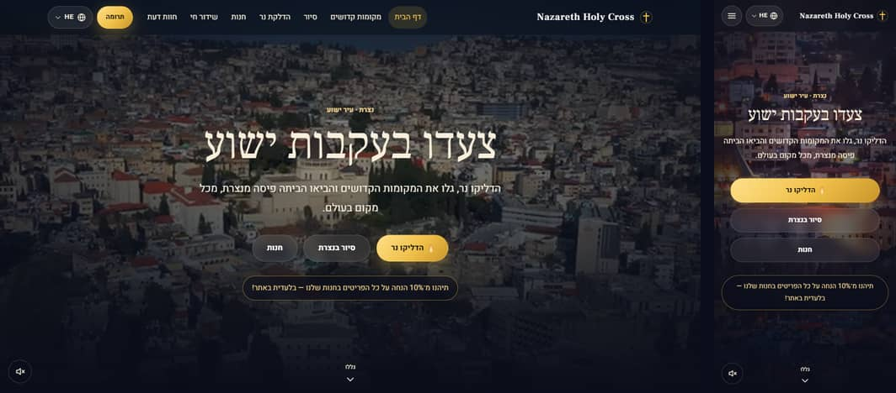

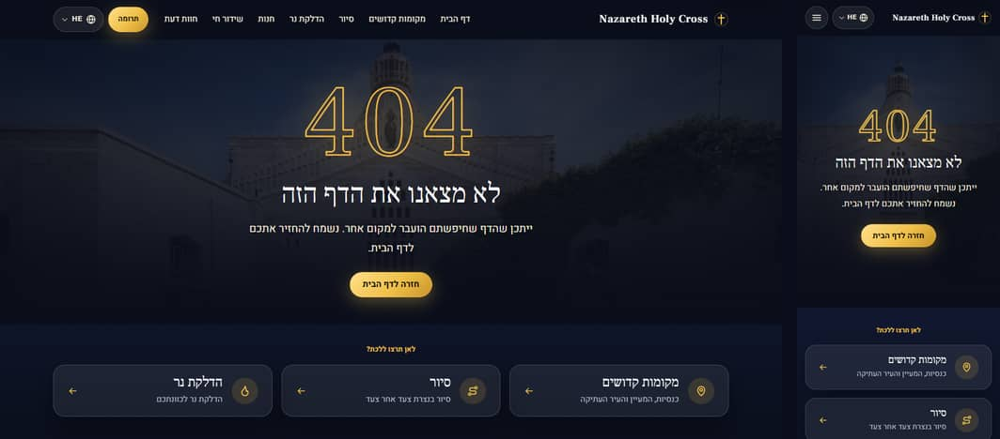

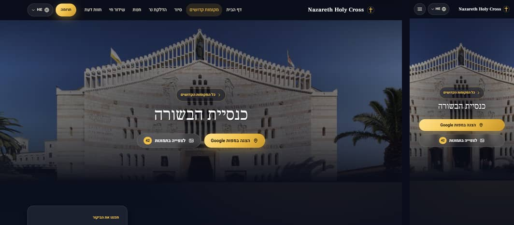

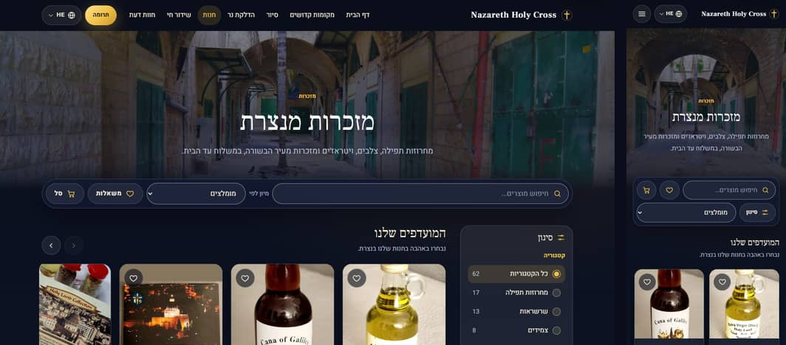

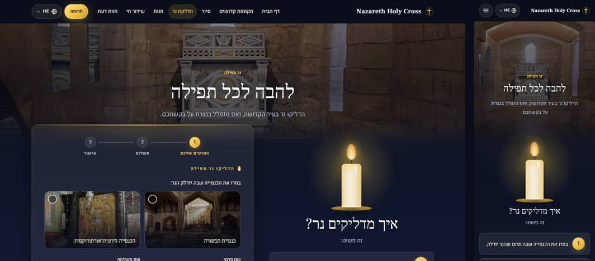

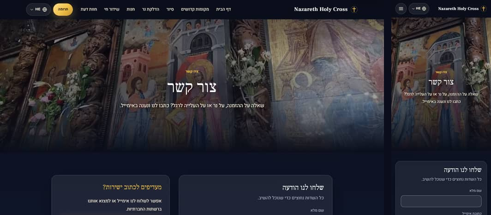

## 9. Performance budgets

Visitors are on phones and slow networks. Performance is part of "done".

### 9.1 Budgets

| Metric | Budget | Enforced by | Measured now (docs/PERFORMANCE.md) |
|---|---|---|---|
| Largest Contentful Paint | under 2.5 s ("good") | `web/tests/e2e/performance.spec.ts`, unthrottled, on `/en`, a holy site, the shop, the candle page, the gallery | 0.13-0.20 s unthrottled; 2.1-2.9 s on a throttled slow phone, 4.1-5.5 s in Lighthouse's slow-4G simulation |
| Cumulative Layout Shift | under 0.1 ("good") | same test | 0.000 on all five pages |
| Interaction to Next Paint | under 200 ms ("good") | **not asserted by any test**; use total blocking time in Lighthouse as the proxy | blocking time 10-65 ms in Lighthouse, 48-285 ms in the throttled probe |
| Images loaded before scrolling | under 1 MB per page | the same test | 109-698 kB |
| JavaScript, all of it, compressed | under 350 kB per page | the same test | 195-295 kB (React, Next, next-intl, the layout) |
| Fonts | under 250 kB per page | the same test | 90 kB (two Latin files preloaded) |
| Hero film | under 3 MB, never on a phone | the same test | 1.4 MB WebM, 2.0 MB MP4 |
| Cache | photos and videos one month; other images one day; `/_next/static` immutable; an anonymous request gets no `Set-Cookie` | the same test | |

Guidelines for new work (not enforced by a test, but reviewers will ask):

- A new page adds no new dependency and no more than about 20 kB of client JavaScript. Prefer server components;
  mark a component `'use client'` only when it needs state, effects or browser APIs.
- Load rarely-used heavy parts lazily (the PayPal panel, the photo viewer, the search palette are all lazy).
- Every `next/image` and `<MediaPicture>` has a truthful `sizes`; below-the-fold images are lazy; give every image
  `width` and `height` or an `aspect-ratio` so nothing shifts.
- Fonts: do not add a family or weight without measuring (`next/font` preloads the Latin files only).
- Animations on `transform` and `opacity` only; no `backdrop-filter` stacked more than two deep on a phone.
- Do not read layout (`offsetHeight`) in scroll handlers; use passive listeners and `IntersectionObserver`.
- Every API read is cached by Next's data cache and survives a 429 or a 5xx with retries (`web/src/lib/api.ts`); a
  new read goes through `getJson`, never a bare `fetch`.
- Pages are rendered per request because each response carries its own CSP nonce (section 10): the HTML is not
  cacheable at the CDN. Keep the server render cheap: no sequential awaits that could be `Promise.all`.

### 9.2 How to check

```bash
cd web
export SWC_NATIVE_BINDING_CACHE=C:/Users/<you>/nhc/.swc-cache      # Windows only
npx next build && npx next start -p 3802 &
E2E_PORT=3802 PW_CHANNEL=msedge npx playwright test tests/e2e/performance.spec.ts
PW_CHANNEL=msedge QA_BASE=http://localhost:3802 QA_LABEL=run node tests/qa/measure-perf.mjs   # throttled phone probe
QA_BASE=http://localhost:3802 QA_LABEL=run CHROME_PATH="C:/Program Files (x86)/Microsoft/Edge/Application/msedge.exe" node tests/qa/lighthouse.mjs
node scripts/media/audit.mjs                                        # soft or small photos
```

Check the live API's rate limit before builds and end-to-end runs (200 requests per 15 minutes per address, shared
by everything on the machine): `curl -sI https://nazareth-holy-cross-api.onrender.com/health` and read the
`ratelimit` header; throttled runs show error states that are not bugs.

## 10. Security and privacy rules for UI work

Full threat model: `docs/SECURITY.md`. What a UI change must respect:

1. **Content-Security-Policy with a per-request nonce** (`web/src/proxy.ts`, `web/src/lib/csp.ts`):
   `script-src 'self' 'nonce-...' 'strict-dynamic'`, no `unsafe-inline`, no `unsafe-eval` in production,
   `style-src 'self' 'nonce-...'`, `font-src 'self'`, `object-src 'none'`, `frame-ancestors 'none'`. The nonce is
   put on Next's own scripts automatically; the root layout reads it from the request headers
   (`x-nonce`) and exposes it through `<CspNonceProvider>`; a client component that starts a third-party script
   passes `useCspNonce()` to it (`<PayPalPanel>` does).
2. **No inline scripts, no inline event handlers, no `<style>` elements you wrote by hand.** The only `<script>` you
   write is `<JsonLd>`, built by `web/src/lib/jsonLd.ts`, which escapes `<`, `>`, `&` and U+2028/9. The one
   exception is the accessibility pre-paint script in `web/src/app/[locale]/layout.tsx`: a constant string
   (`A11Y_PREPAINT`, no visitor data in it) that carries the request's nonce. Inline `style=""`
   attributes are tolerated only to pass CSS variables or computed sizes (CSP `style-src-attr 'unsafe-inline'`
   is a recorded, accepted risk in `docs/SECURITY.md`); never use them for static styling.
3. **Never** use `dangerouslySetInnerHTML` for anything but JSON-LD, `eval`, `document.write` or `innerHTML =`.
   `web/tests/unit/security.test.ts` fails if a new use bypasses the serializer, and if a `target="_blank"` link
   lacks `rel="noopener noreferrer"`.
4. **Visitor text** (reviews, prayers, names) is rendered as React text only. The API stores it HTML-escaped;
   decode it once with `web/src/lib/plainText.ts` for display as text.
5. **Storage rules.** `localStorage` holds only the cart (`nhc.cart.v1`), the wishlist, recently viewed products,
   lit candles, liked prayers and the accessibility settings (`nhc.a11y.v1`): never a credential, a token, an e-mail address or a prayer text. Anything read
   back is validated (24-hex id, bounded quantity, text fields) because any script on the origin can edit it. The
   only cookie is `NEXT_LOCALE`. Wrap storage in `try/catch` (private mode) and render correctly without it. The
   admin keeps its session in an `httpOnly` cookie only.
6. **Forms.** Public forms post straight from the browser to the API, which validates again and rate-limits. Show a
   specific message for 429 ("wait a few minutes"), 4xx and network failure; keep what the visitor typed. The
   browser never decides an amount: it says what is bought, the API prices it. No password fields on the public
   site. Do not log form contents to the console.
7. **Third-party scripts policy.** None except PayPal (loaded lazily at the payment step). No analytics, no
   chat widget, no map embed (maps are links to Google Maps), no fonts from a CDN, no tag manager. To propose one:
   the owner decides first (cost, privacy, legal text, consent), then add its hosts to `web/src/lib/csp.ts` with a line in
   `web/tests/unit/csp.test.ts`, never loosen the policy, load it lazily, and update `docs/SECURITY.md`.
8. **Images from other origins** only from Firebase Storage (`remotePatterns` in `web/next.config.ts`); anything
   else a visitor could put into storage is not rendered (`<CartView>` shows only local and Firebase images).
9. **Secrets never reach the browser.** Only `NEXT_PUBLIC_*` variables are read in client code; the PayPal client id
   is public by design. `npm run scan:bundle` checks the build.
10. **Links to other sites** are constants in the code (social profiles, Google Maps), never built from user input.
    Redirects only produce paths on this site.
11. **Privacy of the UI itself.** Do not put names, e-mail addresses or order numbers in URLs, titles or
    analytics-like requests. Candle intentions are private: do not show them publicly or in logs. The admin shows
    personal data and so is `noindex`, `no-store`, CSRF-checked, and forgets an idle session after 30 minutes.

## 11. Admin dashboard design rules

The admin (`admin/`, Next.js 16, English, Hebrew and Arabic) shares the public site's night and gold language so
the owner recognises it, but it is a tool, not a showpiece: calm, dense, fast, hard to misuse. Behaviour and
contract: `docs/ADMIN-UI.md`, `docs/ADMIN.md`, `docs/ADMIN-RUNBOOK.md`, `admin/README.md`. It is local only for now.

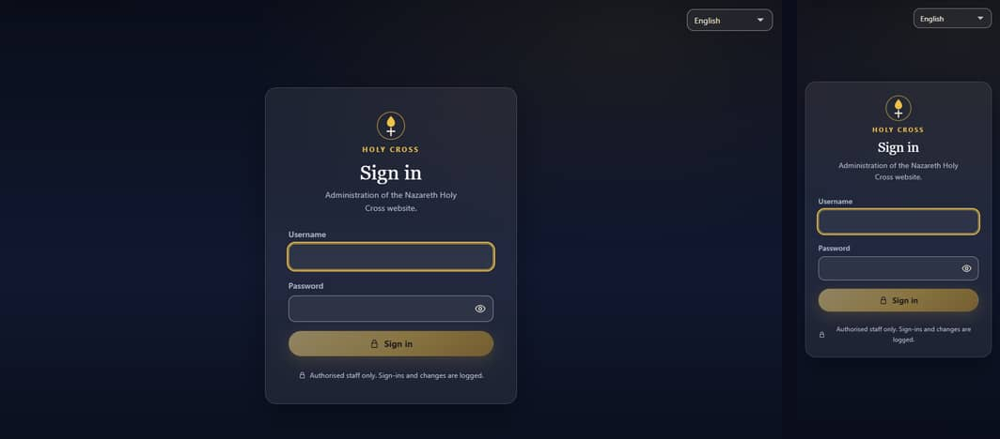

### 11.1 Differences from the public site

| | Public site | Admin |
|---|---|---|
| Class names | `ui-*` prefix | Short names without prefix (`.btn`, `.panel`, `.badge`, `.table`) in `admin/src/styles/*.css` |
| Fonts | `next/font` (EB Garamond, Inter, Hebrew and Arabic pairs) | System stacks, nothing downloaded; `--mono` for ids |
| Tokens | `web/src/styles/tokens.css` | A copy: `admin/src/styles/tokens.css`. The colour tokens must stay equal (the guide test compares them); add admin-only tokens at the bottom |
| Icons | `web/src/components/ui/icons.tsx` | `admin/src/components/ui/Icon.tsx` (names such as `orders`, `trash`, `lock`) |
| Chart library | none | none: small SVG components with a data table behind each (`admin/src/components/charts/TimeSeriesChart.tsx`) |
| Density | airy, reading first | compact: `.table` 0.95rem, 12px cell padding, buttons `.btn--sm` 38px |
| Motion | slow reveals, page transitions | almost none: hover lifts 1px, drawers and dialogs slide, everything off for reduced motion |
| Theme | dark | dark (`color-scheme: dark`) |
| Languages | 14 | en, he, ar (`admin/src/i18n/messages/`); a test fails when a key or a placeholder is missing |

### 11.2 Layout

- **Shell** (`admin/src/components/shell/AppShell.tsx`): a 264px sidebar (`--sidebar-w`) with the brand, grouped
  navigation (Overview, Inbox, Catalog, Administration), the language selector and the user card (name, role, sign
  out); `<main id="main" tabIndex=-1>` at most 1480px wide. At 960px and narrower the sidebar becomes a slide-in
  panel behind a menu button in a top bar (`aria-expanded`, `aria-controls`, Escape closes and returns focus, a
  scrim closes on tap).
- **Page frame:** `<PageHeader>` (eyebrow, `<h1 id="page-title">` that receives focus after navigation, lead,
  actions) then content. Content sections are `<Panel>` (`.panel`: glass card with a serif title and an optional
  action).
- **Dashboard:** `.kpis` (auto-fill cards, min 210px, each a link to its list, gold tone when something needs doing,
  warn tone for low stock) then charts, rankings and recent items.
- **List page:** `<PageHeader>`, `<ListToolbar>` (search, status filter, sort, Apply, Reset, Export CSV), a
  `<DataTable>`, `<Pagination>`. Everything in the URL (`?q=&status=&sort=&page=`), so any view is shareable and the
  Back button works.
- **Detail:** a `<Drawer>` (native `<dialog>`, 540px from the end edge, closes by navigating back to the list URL, so
  `?open=<id>` is a deep link). Edit forms are full pages (`/products/new`, `/products/<id>`) with a sticky action
  bar.
- **Breakpoints:** 1180 (grids collapse), 960 (shell), 860, 760 (tables become cards), 560 and 480 (forms single
  column).

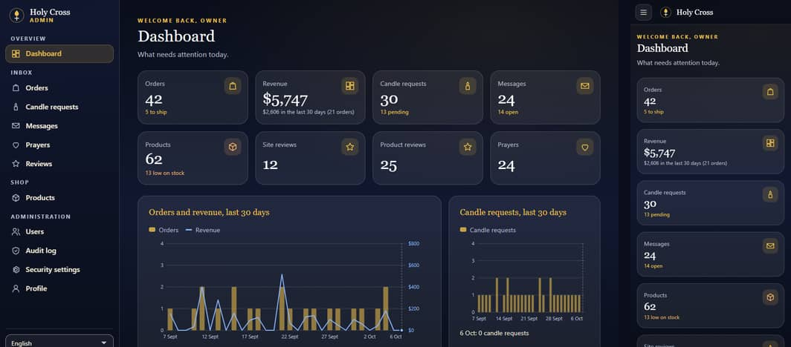

### 11.3 Density, tables to cards

Wide screens show real tables (`<DataTable>` in `admin/src/components/ui/Primitives.tsx`): uppercase
column headers (not in Hebrew and Arabic), the primary cell first, numbers and money aligned to the end, row hover,
a muted row for disabled items, actions at the end. The wrapper is `role="region"` with `tabIndex={0}` and an
`aria-label` so a sideways-scrolling table is reachable by keyboard.

From 760px down each row becomes a card: the header row is visually hidden, every cell shows its column name from
`data-label` (`td::before`), the `primary` cell becomes the card title, and the actions sit at the bottom of the
card. **Always give every column a `header` (used as that label) and mark exactly one column `primary`.** There is
no sideways scroll from 360px.

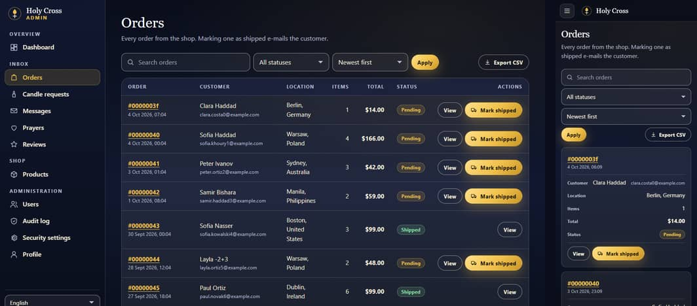

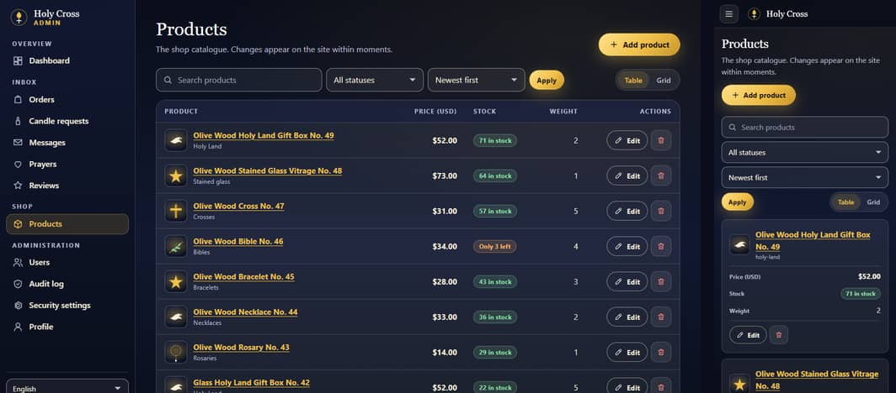

### 11.4 Destructive and consequential actions

- Every destructive action asks first, with a native `<dialog>` confirm (`confirm()` from the feedback provider in
  `admin/src/components/ui/Feedback.tsx`): a title that names the thing, a one-sentence consequence, "Cancel"
  focused by default and the danger button on the right (`.btn--danger`); Escape and a click outside cancel.
- Row actions use `<ApiAction>` (`admin/src/components/ui/ApiAction.tsx`): optional `confirm`, a spinner and
  `aria-busy` while it runs (a second click is impossible), a success toast, an error toast with the API's message
  when it is a 4xx and a generic one otherwise, then `router.refresh()`. Icon-only variants need an `ariaLabel` that
  names the row ("Delete order 000003ab").
- Consequences outside the app are said before the click: "Mark shipped" e-mails the customer exactly once; the
  toast tells the three cases (sent, not sent so write to the customer, already shipped).
- Deleting is rare and hard: orders can be deleted only by the owner; users cannot touch their own row.
- Prefer reversible actions (hide a review, disable a user) to deletion; show them first.
- Forms validate on the client with the API's limits and then show the API's own error; a failed save keeps what was
  typed.

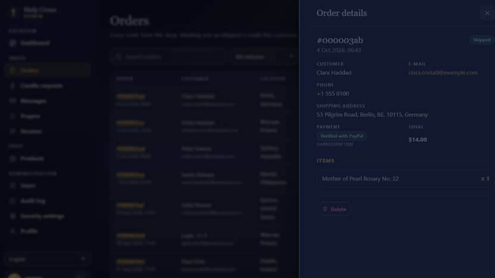

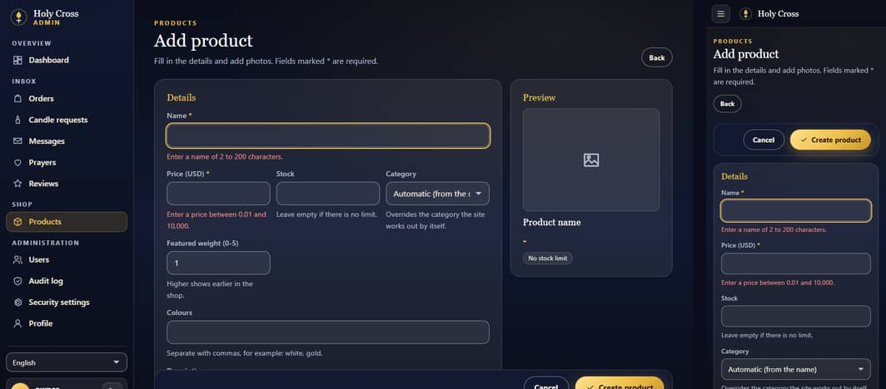

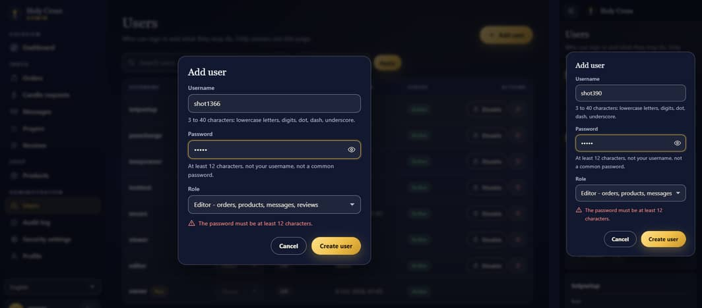

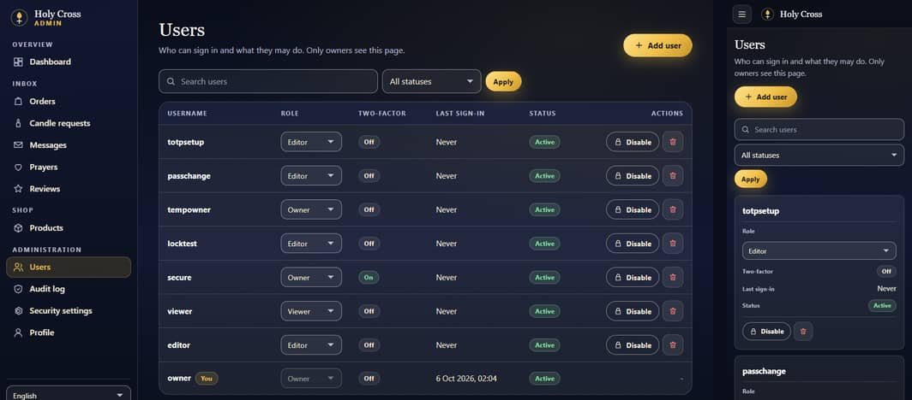

### 11.5 Roles in the UI

Roles are `owner`, `editor`, `viewer` (`admin/src/lib/roles.ts`). The API enforces them per route; the UI only
**hides what the API would refuse**, so a stale or tampered UI never widens access.

| Capability | owner | editor | viewer |
|---|---|---|---|
| Read everything, open drawers | yes | yes | yes |
| `write` (mark shipped or done, hide reviews, edit products, delete messages, requests, prayers) | yes | yes | no |
| `export` CSV (a bulk copy of personal data) | yes | yes | no |
| `deleteOrders` | yes | no | no |
| `manageUsers`, `viewAudit` | yes | no | no |

Rules: check with `can(role, capability)`, never with a role name in a component; a button the role cannot use is
**not rendered** (not disabled-and-explained), and a page the role cannot open shows the `<Forbidden>` state (a
lock icon, "You do not have access", a way back) instead of crashing; navigation entries come from `NAV` with
`needs` (`navFor`). The user card always shows the signed-in role.

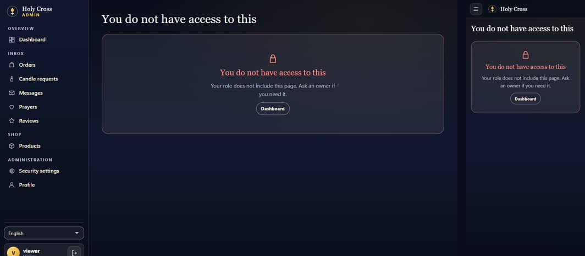

### 11.6 Audit visibility

Every change is recorded by the API (who, what, when, from which device; the address only as a salted hash). The
owner sees it in the Audit log page (`admin/src/app/(app)/audit/page.tsx`: a table filtered by user and action).
Rules for new features: a new write route needs an audit action on the server; the audit page must be able to show
it (action names are Latin text and use `.ltr`); never show an IP address, a token or a password anywhere in the UI.
Session facts the user should see: their role, when the session ends, a sign-out button, and an idle warning dialog
for the last two minutes of 30 (`<IdleGuard>`).

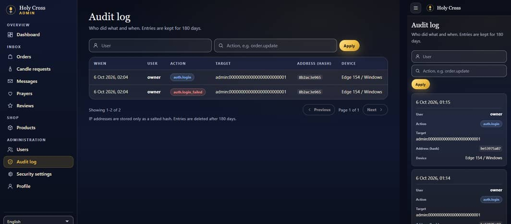

### 11.7 Empty, error and loading states

Every list has all four: loading (`.skeleton` shaped like the table, from `loading.tsx`), empty
(`<EmptyState>`: "Nothing here yet" with the next step), no match (empty with "Reset filters"), and error
(`<ErrorState>`: forbidden, rate limited, or generic, each with a retry link to the same page). A page that cannot
load its data still renders its header and navigation. Errors say what the person can do; the API's raw messages are
shown only when they are 4xx and written for people (the contract). A missing field in an API answer becomes one
clear "unexpected answer" error, never a broken page.

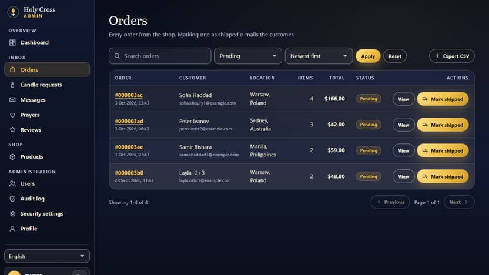

### 11.8 Admin components and classes

`<PageHeader>`, `<Panel>`, `<Badge>` (tones `neutral`, `gold`, `success`, `warn`, `danger`, `info`), `<StateBox>`,
`<EmptyState>`, `<ErrorState>`, `<Forbidden>`, `<DataTable>`, `<ListToolbar>`, `<Pagination>`, `<Field>` (label and
value in a drawer), `<Ltr>` in `admin/src/components/ui/Primitives.tsx`; `<Drawer>`, `<ApiAction>`, the feedback
provider with toasts and confirm in `admin/src/components/ui/Feedback.tsx`; `<AppShell>`, `<IdleGuard>`,
`<LanguageSwitcher>`, `<BrandMark>` in `admin/src/components/shell/`; `<TimeSeriesChart>` and `<QrCode>`.
Classes (in `admin/src/styles/`): `.btn`, `.btn--gold`, `.btn--ghost`, `.btn--ghost-danger`, `.btn--danger`,
`.btn--sm`, `.btn--block`, `.icon-btn`, `.badge`, `.panel`, `.kpi`, `.table`, `.table-wrap`, `.toolbar`, `.pager`,
`.tabs`, `.segmented`, `.drawer`, `.dialog`, `.toast`, `.toasts`, `.state`, `.alert`, `.skeleton`, `.input`,
`.select`, `.textarea`, `.field`, `.hint`, `.ltr`, `.muted`, `.strong`, `.visually-hidden`. They follow the same
state rules as the public equivalents (hover, active, disabled, `aria-busy`, focus ring, reduced motion).

## 12. Definition of done for UI work

A UI change is done when all of the following are true and you can say so honestly (only claim a check you ran).

### 12.1 Automated (run these exact commands)

```bash
# web (public site), from web/
export SWC_NATIVE_BINDING_CACHE=C:/Users/<you>/nhc/.swc-cache      # Windows: needed for next build
export TURBOPACK_ROOT=C:/Users/<you>/nhc                           # only in a git worktree with a shared node_modules
npm run lint
npm run typecheck
npm test                                    # unit tests, including design-guide.test.ts and conventions.test.ts
npx next build
npm run scan:bundle
E2E_PORT=3830 PW_CHANNEL=msedge npx playwright test    # runs against `next start` on that port (build first)

# api, from server/ (if the API or a contract changed)
npm test

# admin, from admin/ (if the dashboard changed)
npm run check                               # lint + typecheck + unit tests + build
npm run test:e2e
```

Before a build or an end-to-end run, check that the live API still has requests left (it allows 200 per 15
minutes per address, shared by everything on the machine): `curl -sI https://nazareth-holy-cross-api.onrender.com/health`
and read `ratelimit`. CI (`.github/workflows/ci.yml`) runs the same steps; a green local run is expected before a
pull request is opened.

### 12.2 By eye (the tools cannot judge these)

- [ ] Looked at on desktop (1366) **and** phone (390), in an LTR language and in `/he` or `/ar`.
- [ ] Tab through the page: order, visible focus, no trap; use it with the keyboard only.
- [ ] Text zoom 200% and a 320 px window: nothing clipped, no horizontal scroll.
- [ ] Reduced motion on: nothing moves by itself.
- [ ] Slow network (throttle) and offline: loading, empty and error states are present and sensible.
- [ ] A long German or Russian label and a short English one both fit.
- [ ] Screenshots attached to the pull request for any visual change.

### 12.3 In the same change

- [ ] Messages added to **all 14** language files (admin: en, he, ar), no hard-coded text.
- [ ] Only tokens and existing `ui-*` classes used; a new token or class is documented in this guide (the guide test
      fails otherwise) and in `docs/DESIGN.md` if it is part of the shell.
- [ ] Docs updated: this guide, `docs/DESIGN.md`, `docs/ENGINEERING.md`, `docs/ADMIN-UI.md` and the QA notes as
      relevant.
- [ ] Tests added for new behaviour: a unit test for logic, an end-to-end test for a flow, an axe check for a new page.
- [ ] No new dependency (or a reason in the pull request); no secret printed or committed.
- [ ] The pull request template (`.github/pull_request_template.md`) is filled in honestly: what was verified and
      what was not.

## 13. Anti-patterns seen in this project

Each one happened (or nearly did) here. The right-hand column says what catches it.

| Anti-pattern | Why it hurts | Instead / caught by |
|---|---|---|
| **Raw colours and typeface names** in a component stylesheet (`#f0c04a`, `rgba(...)`, `font-family: Georgia`) | The look can no longer be changed in one place; dark/contrast drift | Tokens; `web/tests/unit/conventions.test.ts` |
| **A hand-written `-webkit-backdrop-filter` twin** next to `backdrop-filter` | The production CSS minifier keeps only the prefixed twin and Chrome and Edge ignore it, so the blur vanishes in the build while it works in `next dev` | Write `backdrop-filter` alone (the build adds the Safari prefix); check `getComputedStyle(el).backdropFilter` on a production build |
| **`backdrop-filter` on the header element itself** | It becomes the containing block of the fixed mobile drawer and traps it | A blurred `::before` (see `web/src/components/layout/SiteHeader.module.css`) |
| **Concatenated strings and hand-built plurals** (`'You have ' + n + ' items'`) | Wrong word order, case and plural form in 12 of 14 languages | One ICU message with placeholders; lint and `messages.test.ts` |
| **Hard-coded English** in JSX, `alt`, `aria-label`, `placeholder`, `title` | Untranslated, un-reviewable text | `npm run lint` rejects it |
| **`left` / `right` / `margin-left` in CSS** | Hebrew and Arabic look broken | Logical properties; conventions test |
| **Installing a service worker** | The August 2026 worker served styles and scripts cache-first and broke the icon stylesheet with a cached opaque response for returning visitors; `web/public/sw.js` now exists only to retire it | Do not add a service worker without the owner's explicit decision and a rollback plan; keep `/sw.js` served with no-cache |
| **Publishing a Netlify build that 404s** | Merging the new site made every page of nazarethholycross.com answer 404 on Netlify, and the edge cached the 404; `netlify.toml` had to be reverted to the previous site (hotfix `b4f5baa`). After the fix, a preview still showed `/latin` and `/product/:id` as 404 until the legacy redirects were also written with a language prefix | `netlify.toml` names `@netlify/plugin-nextjs`; **verify the deploy preview answers HTTP 200 on real pages before merging a Netlify-affecting change** (`docs/ADMIN-RUNBOOK.md` section 4, and `docs/WORKING-AGREEMENT.md`) |
| **A `loading.tsx` at `app/[locale]/` or on the review, candle and donate pages** | A Suspense boundary above the catch-all route makes Next stream the 404 page with status 200 (a soft 404); on those pages React rendered a second, hidden copy of the page while hydrating and broke the end-to-end tests | The branded `<LoadingScreen>` via `<PageTransitions>`; `shell.spec.ts` expects a real 404 and checks for a single copy of the page |
| **React's own view-transition component in a `template.tsx`** | A second copy of the DOM during hydration, a flash, duplicate form fields | Browser View Transitions hooked on link clicks (`PageTransitions.tsx`) |
| **A second `next/font` instance of a family "for other scripts"** | Duplicate `@font-face` rules; the browser downloaded the Latin file twice (375 kB of fonts instead of 90 kB) | One instance per family; `subsets` only decides what is preloaded |
| **A small photo stretched across the screen** as a hero | Soft, blurry; and the wrong `sizes` makes the browser pick a file too small for a phone's cropped hero | Licensed 2560 px photos through `<MediaPicture>` with `fill` and a real `sizes` |
| **Content hidden until JavaScript reveals it** | With JavaScript blocked, whole sections stayed at opacity 0 | `@media (scripting: none)` shows them; hero text animates by movement only |
| **Colour as the only signal**, icon-only meaning, emoji or text glyphs as icons | Inaccessible, depends on the visitor's fonts | `.ui-error` with an icon and words; the SVG icon set |
| **A field border at `--glass-line`** | 1.56:1, fails WCAG 1.4.11 (found by QA) | `--field-line` (4.52:1) |
| **Per-page `scroll-margin-top` for the sticky header** | Double offsets, inconsistent jumps | `html { scroll-padding-top }` already does it |
| **Disabling a stepper button at its limit** | Keyboard focus jumps to the top of the page | `aria-disabled` and keep focus |
| **Trusting data read from `localStorage` or the API** | A tampered cart or an API change breaks or exploits the page | Validate on read (zod in `web/src/lib/api.ts`, cart validators) |
| **A bare `fetch` to the API for a page read** | One 429 or 5xx and the section is built empty and stays that way | `getJson` in `web/src/lib/api.ts` (retries, honours `Retry-After`) |
| **`target="_blank"` without `rel="noopener noreferrer"`** | Reverse tabnabbing | `security.test.ts` |
| **Arabic-Indic or other non-Western digits, or an invisible bidi character, in a message** | Prices and numbers read wrongly; copy-paste traps | `messages.test.ts` |
| **Translating the brand name** | The logo is the name | Glossary: never translate or transliterate "Nazareth Holy Cross" |
| **Adding a banner, pop-up, newsletter box or cookie notice** | Violates "nothing asks the visitor for anything they did not come for"; implies tracking we do not do | Do not; owner and legal decision if tracking is ever introduced |
| **Title Case sentences and ALL-CAPS in the message text itself** ("LIGHT A PRAY CANDLE", "Your Cart is Empty") | Looks shouty, breaks translation, cannot be restyled | Sentence case in the message; capitals by CSS in Latin scripts only. These exist today as legacy strings (2.2) |
| **Two gold buttons in one view; a button with only an icon and no `aria-label`; a custom pill** | Dilutes the primary action; inaccessible | One `.ui-btn--gold`; `.ui-btn--icon` with an `aria-label` |
| **Working in the main checkout or on `main`, merging or deploying without approval** | Collisions and surprise deploys (every merge to `main` deploys) | `docs/WORKING-AGREEMENT.md` |

## 14. How to add things

Always: new branch from `origin/main` in your own git worktree, build locally, run section 12, update the docs in
the same change, never merge or deploy without the owner's approval (`docs/WORKING-AGREEMENT.md`).

### 14.1 A public page

1. **Route.** Create `web/src/app/[locale]/<slug>/page.tsx` (a server component). Start from
   `web/src/app/[locale]/faq/page.tsx` (content), `web/src/app/[locale]/contact/page.tsx` (form) or
   `web/src/app/[locale]/sites/page.tsx` (index). Call `setRequestLocale(locale)` and use `getTranslations`.
2. **Metadata and structured data.** `generateMetadata` returns `pageMetadata({ locale, path, title, description,
   image })` from `web/src/lib/seo.ts` (hreflang for all 14 languages plus x-default, `og:locale`); a private page
   passes `noindex: true`. Add `<JsonLd>` with `webPageJsonLd` and `breadcrumbJsonLd` from `web/src/lib/jsonLd.ts`.
3. **Markup.** Root `<div className="ui-page">`; `<PageHero>` (with `media={getMedia('id')}`) for the title; then
   `<section className="ui-section" aria-labelledby="...">` > `<div className="ui-container">`. One `<h1>`.
   Wrap sections in `<Reveal>` if you want the scroll reveal. Page-specific CSS goes in
   `web/src/app/[locale]/<slug>/page.module.css` and uses tokens and logical properties only.
4. **Text.** Add a namespace to **all 14** files `web/src/messages/<locale>.json` (English first, then the others
   following `docs/GLOSSARY.md`). Run `npm test`: the message tests tell you what is missing or unused.
5. **Navigation and discovery.** Add the page to the right list in `web/src/lib/site.ts` (`mainNav` for the header,
   `footerNav`, `pilgrimNav` or `legalNav`); the footer, the sitemap (`web/src/app/sitemap.ts`) and the site search
   (`web/src/data/pilgrim/searchIndex.ts`) read from it. A header link needs a label `site.nav.<key>` and a check that
   the header still fits in every language (the header test in `web/tests/e2e/a11y.spec.ts`).
6. **Tests.** Add the route to the list in `web/tests/e2e/pilgrim.spec.ts` (title, h1, JSON-LD) or write a new spec;
   add it to `ROUTES` in `web/tests/qa/matrix.mjs`, in `web/tests/e2e/a11y.spec.ts` (axe on every page) and in
   `web/tests/qa/a11y-audit.mjs`; unit-test any logic.
7. **Look** at it on desktop and phone, in `/en`, `/he` and `/de`; then section 12.

### 14.2 A language

1. Create `web/src/messages/<code>.json` with every key of `en.json` (copy, translate, keep placeholders and ICU
   plural branches; the plural categories the language needs are enforced in `web/tests/unit/messages.test.ts`:
   add the language there if its rules differ, with its script check).
2. In `web/src/i18n/routing.ts` add the code to `locales`, its name in its own language to `localeNames`, its Open
   Graph code to `openGraphLocales` (and to `rtlLocales` if it is right to left). If it is right to left, also give it
   the font pair rules in `web/src/styles/tokens.css` and `web/src/lib/fonts.ts`, and test every page mirrored.
3. If a new script is needed, add a font instance in `web/src/lib/fonts.ts` with `preload: false`, and its
   variable to `tokens.css` under `:root:lang(<code>)`.
4. Add the language's column to `docs/GLOSSARY.md` and its open questions to `docs/TRANSLATION-REVIEW.md`.
5. Decide whether it gets a currency hint (`web/src/lib/currency.ts`; only for languages that point to one currency).
6. Check the language menu (two columns still fit), the footer languages row, `hreflang` and the sitemap (all read
   `locales`), long words in the hero, and run the whole suite. Machine-made text must be flagged for native review.

### 14.3 A component

1. Decide: public (`web/src/components/<area>/`), shared (`web/src/components/ui/`) or admin
   (`admin/src/components/ui/`). Look for an existing component first (section 5).
2. Server component by default; `'use client'` only for state, effects or browser APIs. Named default export (lint).
3. Styling: a CSS Module beside it (`<Name>.module.css`) using tokens and logical properties, or a global `ui-*`
   class in `web/src/styles/ui.css` if it is reused across areas. Provide hover, `:active`, `:focus-visible`,
   disabled, loading, error and empty states, a `prefers-reduced-motion` branch, `(hover: none)` care, and RTL.
4. Text through next-intl; icons from `web/src/components/ui/icons.tsx`; 44px targets; names for icon buttons.
5. Document it here (section 5; a new global class or token must be listed or the guide test fails) and add a unit
   test (`web/tests/unit/`) with Testing Library for behaviour and accessibility (roles, names, keyboard).
6. Use it in a page and look at it at 390 and 1366 px, LTR and RTL, with the keyboard.

### 14.4 A product category

A category is a key shared by four places; add it everywhere or products fall into "gifts" silently.

1. **API:** `server/services/catalog.js`: add `[key, /pattern/i]` to `CATEGORY_RULES` in the right order (first
   match wins; `gifts` stays last), with a case in `server/__tests__/catalog.test.js`. The product model and the admin
   route read the same list (`server/model/product.js`, `server/route/admin/products.js`).
2. **Public site:** add the key to `CATEGORIES` in `web/src/lib/api.ts`, and the label `shopFeatures.categories.<key>`
   to **all 14** message files. Check the filter list and the product card badge.
3. **Admin:** add the key to `CATEGORIES` in `admin/src/lib/product-form.ts` and `category.<key>` to
   `admin/src/i18n/messages/en.ts`, `he.ts`, `ar.ts`.
4. Update the category list in `docs/ADMIN-UI.md` and run `npm test` in `server/`, `web/` and `admin/`.

### 14.5 An image set (licensed photos)

1. Find candidates: `node scripts/media/search.mjs "<query>" --min 2400` from `web/` (only allowed licences, named
   author). Open the Commons page and look at the photo: sharp, well lit, no watermark, no brand, no banner, no
   identifiable person as the subject.
2. Add an entry to `web/scripts/media/sources.json` (`id`, exact Commons `file`, `topic`, `subject`, English `alt`,
   `focal` percentages, `hero`, `og`). A new `topic` or `subject` also needs `media.topic.*` / `media.subject.*`
   translations in all 14 files and an entry in `web/src/data/media-types.ts`.
3. From `web/`: `npm run media:build` (checks the licence again, writes AVIF/WebP in several widths, a blur
   placeholder, rewrites `web/src/data/media.generated.ts`). Never hand-edit the generated file. Originals stay
   outside the repository.
4. For a photo under a dark gradient run `node scripts/media/lean.mjs <id>` and use `lean`.
5. Use it with `getMedia('<id>')` and `<MediaPicture>` or `<PageHero media=...>`; set `heroFocus` if it is a place
   hero; give it an honest `sizes`. Credits appear automatically in the viewer and `/credits`.
6. Check on a 390 px phone (crop around the subject), run `npm run media:verify` now and then, run the performance
   test, and keep the photo count and repository size in mind (`docs/MEDIA.md`).

### 14.6 An admin page

1. **Server first.** The API route exists under `server/route/admin/` with `requireRole` and an audit entry; the contract is in
   `docs/ADMIN.md`. Add the zod schema and a typed call in `admin/src/lib/api.ts`.
2. **Allow-list.** If the browser must call it, add the method and path pattern to `admin/src/lib/proxy-allow.ts`
   (the proxy refuses everything else).
3. **Navigation and role.** Add the entry to `NAV` in `admin/src/lib/roles.ts` (with `needs` for a restricted
   page), an icon to the `ICONS` map in `admin/src/components/shell/AppShell.tsx` (and to the group in `GROUPS`).
4. **Page.** Create `admin/src/app/(app)/<name>/page.tsx` as a server component following
   `admin/src/app/(app)/prayers/page.tsx`: `generateMetadata`, `<PageHeader>`, `<ListToolbar>`, `load(...)` with
   `<ErrorState>` and `<EmptyState>`, `<DataTable>` with a `primary` column, `<Pagination>`, row actions with
   `<ApiAction>` guarded by `can(user.role, 'write')`. Drawers for details, pages for forms.
5. **Text.** Add the keys to `admin/src/i18n/messages/en.ts`, `he.ts` and `ar.ts` (the test compares them).
6. **Tests.** A unit test for parsing or formatting, a case in `admin/tests/e2e/pages.spec.ts` (and the roles spec
   if visibility depends on a role), and a mock route in the mock API if it is a new resource
   (`admin/mock-api/`; the parity test keeps mock and real API aligned).
7. Look at it at 1366 and 390 px, as owner, editor and viewer, in English and Hebrew; update `docs/ADMIN-UI.md`
   and this guide.

