# Design system: "Immersive pilgrimage"

How the Nazareth Holy Cross site looks and behaves, and how to build a new page that fits. The rules here are
enforced by the shared CSS (`web/src/styles/`), the shared components (`web/src/components/ui/`,
`web/src/components/layout/`) and the tests in `web/tests/` (`ux.spec.ts`, `ux.test.tsx`, axe in `shell.spec.ts`).
The screenshots are in `docs/design/`. The complete specification (brand and voice, every token and component, page
templates, accessibility, RTL, budgets, the admin dashboard, how to add things) is `docs/DESIGN-GUIDE.md`; this file
is the short reference of the shell.

**Look:** a night sky (deep blue-black), gold for everything that matters or can be pressed, cream for text,
serif headings, glass cards over photographs. **Feel:** quiet, reverent, never busy: motion is slow and small, one
accent colour, photographs do the talking.

## 1. Rules that never bend

1. **Tokens only.** Colours, fonts, spacing, radii, shadows and focus come from `styles/tokens.css`. No raw hex
   values or font names in components.
2. **Logical CSS only.** `margin-inline-start`, `inset-inline-end`, `text-align: start`, `border-inline-start`.
   Never `left`/`right` for layout. The site is mirrored in Hebrew and Arabic with no extra stylesheet.
3. **Every visible word goes through next-intl** (`messages/*.json`, all 14 languages). New strings of the shell
   live in the `ux` namespace.
4. **44px touch targets** (`--tap`) for everything pressable in the header, footer and shared components.
5. **One focus ring** (`--focus-ring`, 3px gold) on everything focusable, never removed.
6. **Motion is optional.** Every animation has a `prefers-reduced-motion: reduce` branch that removes it.
7. **Dark only.** `color-scheme: dark`; there is no light theme.
8. **Nothing asks the visitor for anything they did not come for:** no newsletter box, no cookie banner, no pop-ups.

## 2. Foundations

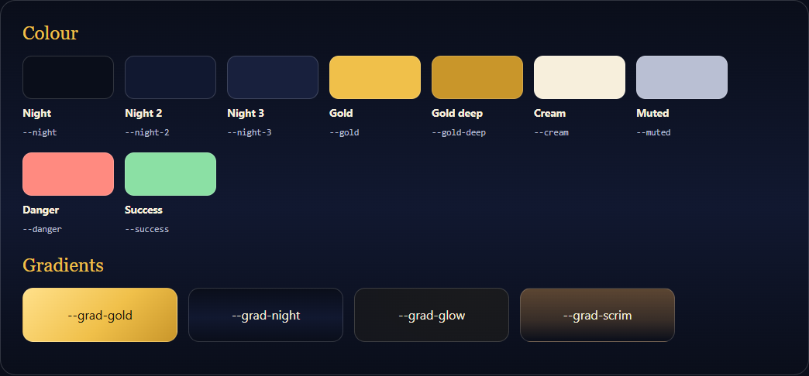

### Colour (`tokens.css`)

| Token | Use |
|---|---|
| `--night`, `--night-2`, `--night-3` | page background, raised surface, field/menu surface |
| `--gold`, `--gold-deep`, `--gold-soft` | accent, pressed/primary, tinted fill for "current" and "selected" |
| `--cream`, `--muted` | body text, secondary text (contrast on night: 16.8:1 and 10.5:1) |
| `--danger`, `--success` | errors, confirmations (always with an icon or words, never colour alone) |
| `--glass`, `--glass-strong`, `--glass-line` | translucent surfaces and their hairline border |

Gradients: `--grad-gold` (primary buttons), `--grad-night` (page), `--grad-glow` (soft gold light, top right),
`--grad-scrim` (dimming over a photograph), `--grad-card-shade` (text over a card photograph).

### Typography

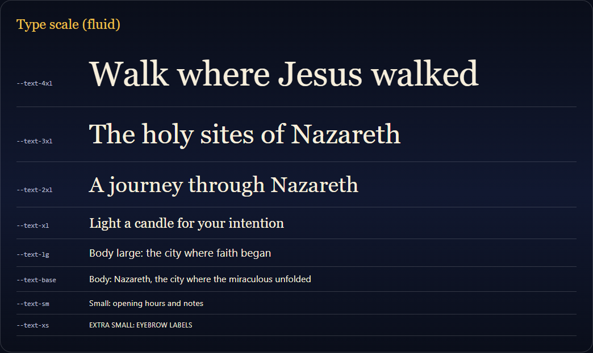

Serif (EB Garamond, Frank Ruhl Libre for Hebrew, Amiri for Arabic) for headings; sans (Inter, Heebo, IBM Plex
Sans Arabic) for text and controls. The scale is fluid, so there are no per-breakpoint font sizes:
`--text-xs` ... `--text-4xl` (`clamp()`; body never below 1rem). Reading text uses `.ui-prose` (68ch measure,
`text-wrap: pretty`); headings balance their lines (`text-wrap: balance`). Hebrew and Arabic get a taller line
(`--leading-body: 1.8`) and never letter-spacing or uppercase (`:lang(he|ar)` rules in `ui.css`).
Long Russian, German, Greek and Polish words shrink hero titles a little on phones instead of breaking mid-word.

### Spacing, elevation, layers

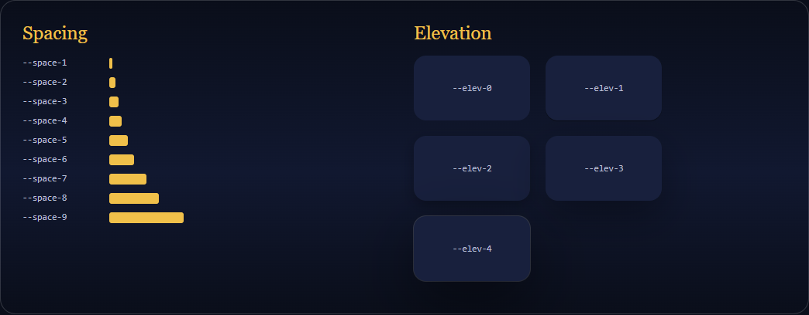

- Spacing: `--space-1` ... `--space-9` (4, 8, 12, 16, 24, 32, 48, 64, 96px). Section rhythm is `.ui-section`
  (`clamp(40px, 7vw, 80px)` block padding); page width `.ui-container` (`--container` 1180px, 16px gutters).
- Elevation: `--elev-0` ... `--elev-4`. Rest = 1-2, cards = 3 (`--shadow`), menus, toasts, hover = 4.
- Layers (`z-index`): sticky actions 40, header 50, menus 60, toasts 80, skip link 100. The reading-progress
  line (51) sits just above the header.
- Header offset: `--header-h` (68px) and `--scroll-offset`. `html { scroll-padding-top }` keeps in-page jumps and
  keyboard focus from hiding under the sticky header; do not add your own `scroll-margin-top` for that.

### Motion

`--ease-out`, `--dur-fast` (150ms), `--dur-base` (250ms), `--dur-slow` (600ms). Hover lifts are 2-4px, reveals
fade and rise 28px once, page changes fade (see 4.8). Nothing loops except the loading halo and Ken Burns on
hero photographs, both removed for reduced motion.

## 3. Components (`ui.css` and `components/ui/`)

### Buttons

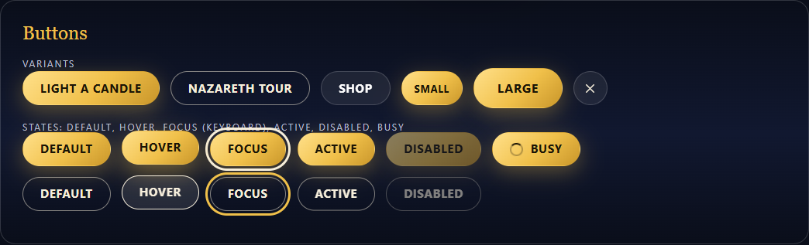

`.ui-btn` + a variant: `--gold` (the one primary action of a view), `--ghost` (secondary), `--glass` (over
photographs); sizes `--sm`, `--lg`; `--icon` (round, needs `aria-label`). States: hover lifts 2px, `:active`
presses (scale .98), focus shows the ring, `:disabled` / `aria-disabled` dims to 50%, `aria-busy="true"` shows
the progress cursor and ignores clicks (put a `.ui-spinner` inside). `--sm` is smaller in type and padding but
still 44px tall. Hebrew and Arabic buttons are not uppercased.

### Surfaces, badges, links

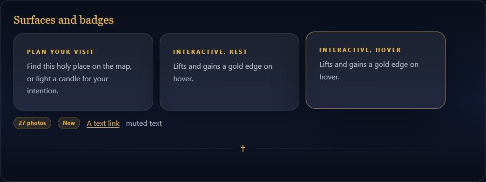

`.ui-glass` (+ `.ui-card` for padding) is the standard card. `.ui-card--interactive` adds the lift and gold edge
for cards that are links. `.ui-badge`, `.ui-divider`, `.ui-link` (underlined gold text link), `.ui-ltr` (keeps
e-mail addresses and Latin names left-to-right inside Hebrew/Arabic text), `.ui-tools` (a row of small actions).

### Forms

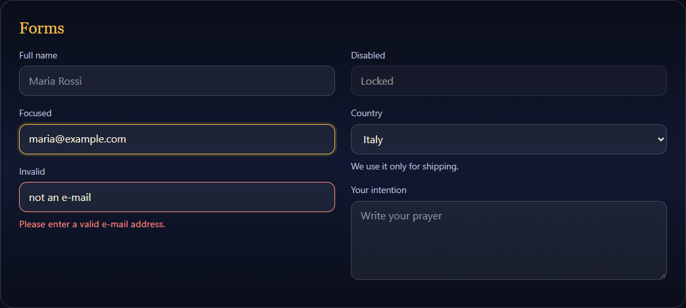

`.ui-field` > `.ui-label` + `.ui-input` / `.ui-select` / `.ui-textarea` + `.ui-hint` / `.ui-error`. Invalid is
`aria-invalid="true"` (red border) plus an `.ui-error` message linked with `aria-describedby`. Fields are 46px
tall, 16px type (no zoom on iOS).

### Empty, error, loading

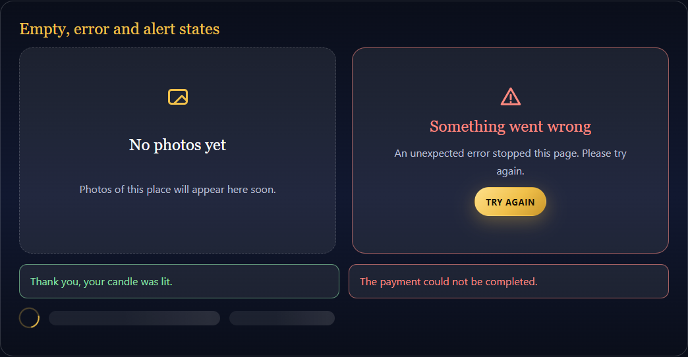

`.ui-state` (+ `--error`) for empty and failed content (give it `role="status"` or `role="alert"`), `.ui-alert`
for inline messages, `.ui-spinner`, `.ui-skeleton` (shimmer, static for reduced motion). A page's own loading
screen is `LoadingScreen` (see 4.7).

### Icons

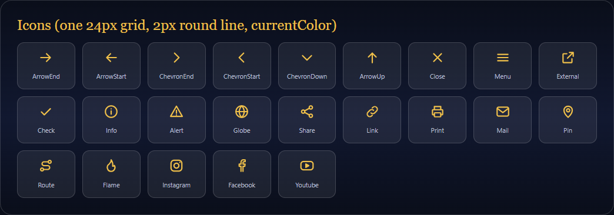

`components/ui/icons.tsx`: one inline-SVG set (24px grid, 2px round stroke, `currentColor`, decorative
`aria-hidden`). Size with `size` or `--icon-size`. Arrows and chevrons take `flip` and mirror in RTL. `CrossMark`
is the brand mark. Older icon files (`home/icons`, `places/icons`, `community/Icon`) still work and share the look.
No emoji and no text glyphs (`✝`, `★`, `→`) as icons.

### Other shared pieces

| Component | What it does |
|---|---|
| `Toast` (`ToastProvider`, `useToast()`) | Restrained notifications: `toast.show({ message, kind: 'success' \| 'error' \| 'info' })`. Polite live region, errors are `role="alert"`, max 3, pause on hover/focus, 44px close, silent no-op without provider. |
| `PageTools` | "Copy link" (or the phone's share sheet) and "Print"; tells the visitor with a toast. |
| `Reveal` | Fade-and-rise once when scrolled into view. |
| `Stars` | Read-only rating drawn with SVG stars (no font dependence). |
| `PageHero` / `PlaceHero` | Page header with photograph; `PlaceHero` takes `focus` (CSS object-position) so tall phone crops keep the subject. |

## 4. The shell

### 4.1 Header and menus

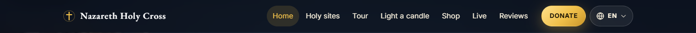
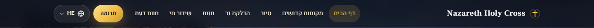

Sticky; frosted glass (a blurred pseudo-element, so the fixed drawer is not trapped inside it) that turns
more opaque after 12px of scrolling. Gold "Donate" button from 1240px (1320px in Russian, the longest labels); below 1100px the links become a drawer.

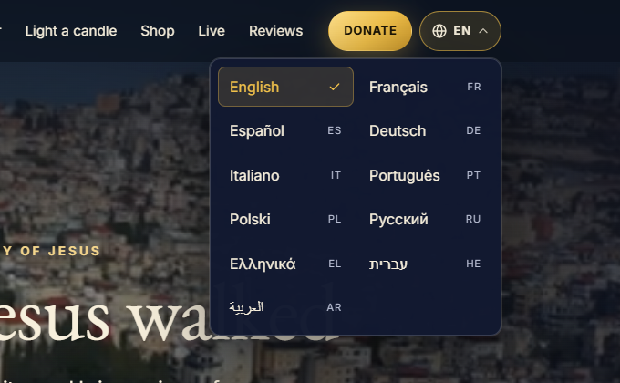
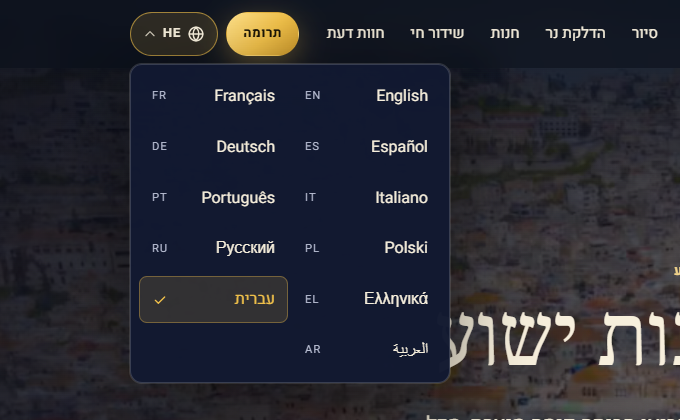

**Language menu:** all 14 languages, each in its own script, two columns, current one ticked. Keyboard: Enter or
arrow-down opens and focuses the current language; arrows (mirrored in RTL), Home, End move; Escape closes;
choosing a language reopens the same page in it and puts the focus back on the button.

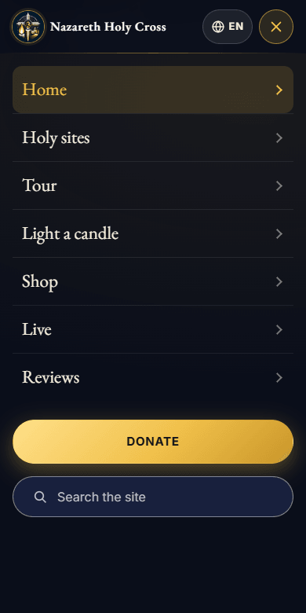
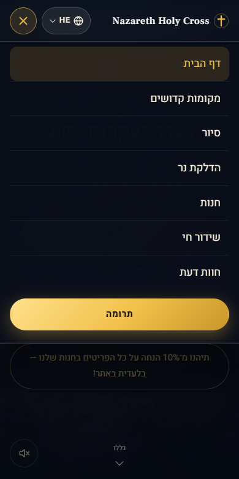

**Drawer:** opens under the header with the page dimmed behind it and scroll locked; focus moves to the first
link, Escape returns it to the menu button, a tap on the dimmed page closes it.

### 4.2 Footer

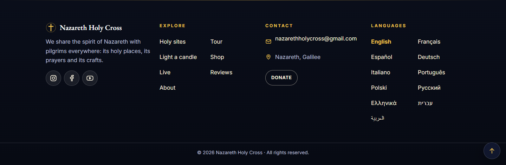
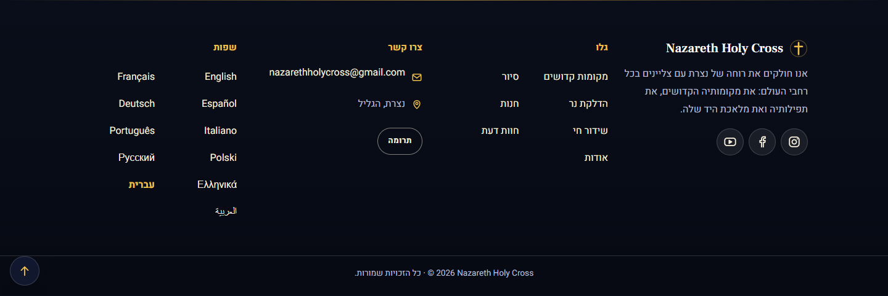

Four calm columns: who we are with social buttons (44px), explore, contact (with Donate), and every language as
a real link (`hreflang`, `aria-current`, no prefetch). No newsletter, no cookie banner. The copyright line keeps
the year and name as one left-to-right unit inside right-to-left text.

### 4.3 Skip link and focus

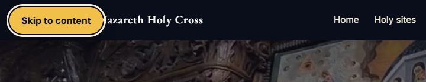
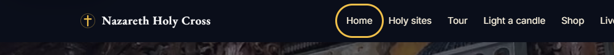

The skip link is the first tab stop and jumps to `<main id="main">`. After every client-side navigation the focus
moves to `<main>` (`RouteFocus`) so keyboard and screen-reader visitors start at the new page. Menus return the
focus to the control that opened them (language menu, drawer, the photo viewer already did).

### 4.4 Back to top and reading progress

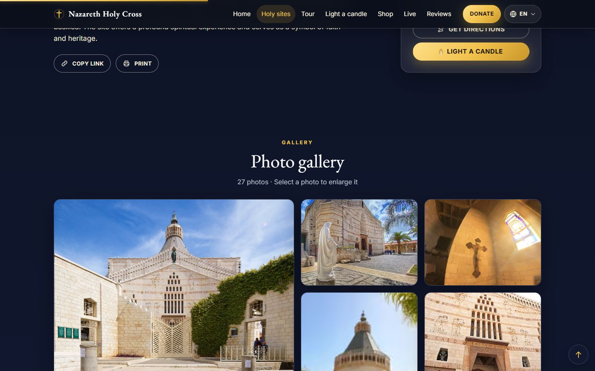

`BackToTop` appears after 1.4 screens of scrolling, is out of the tab order while hidden, and hands the focus to
`<main>`. On the home page it stacks above the "light a candle" button. `ReadingProgress` is a 3px gold line at
the top of the window on long pages (every `/sites/<slug>`, `/tour`, `/about`); it grows from the start of the line
(right edge in Hebrew and Arabic). Both are hidden in print.

### 4.5 Toasts

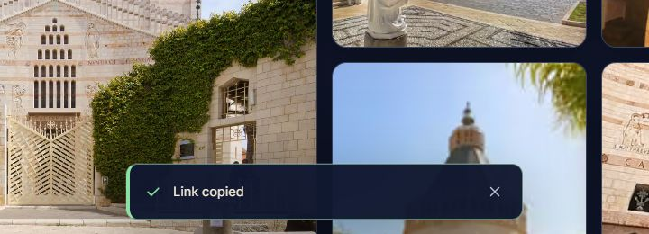

### 4.6 404 and errors

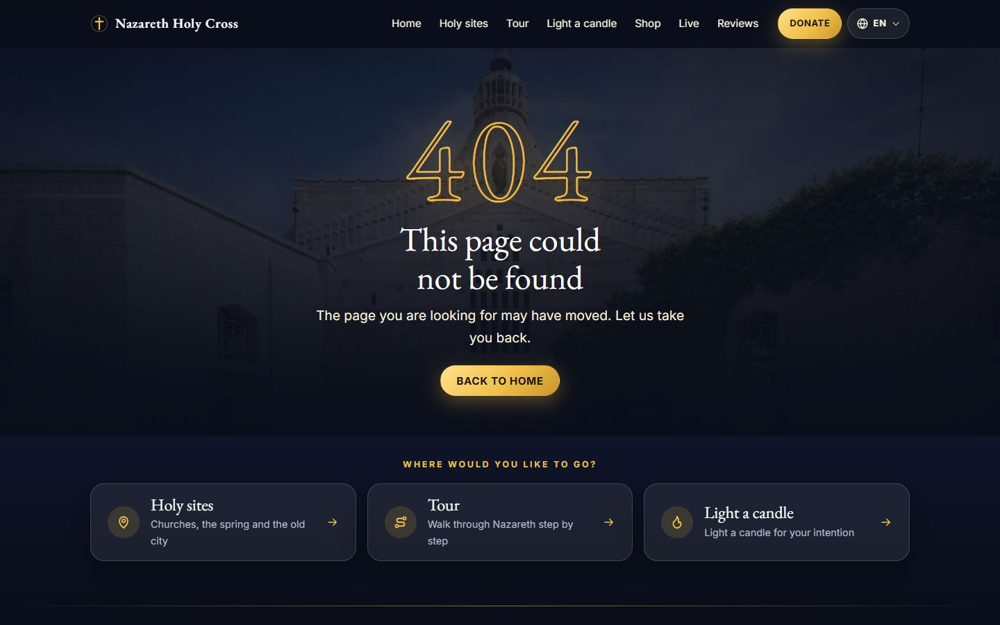
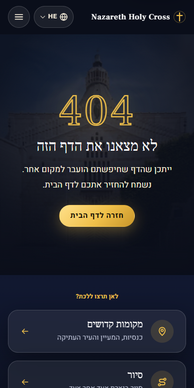

The 404 keeps its real HTTP 404 status, shows the basilica behind a large gold "404", one primary action and three
suggestions. `app/[locale]/error.tsx` is the same family (focus on the heading, "Try again" and "Home");
`app/global-error.tsx` is the last resort when even the layout fails and carries its own texts in all languages.

### 4.7 Loading

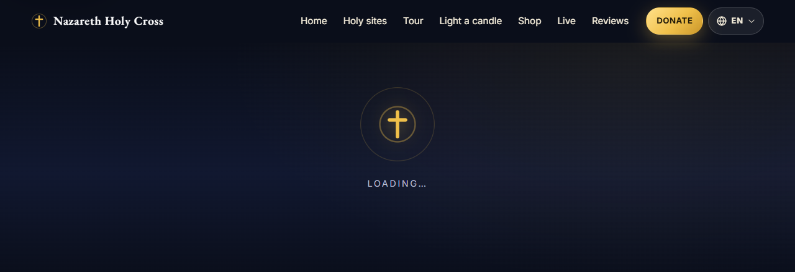

`components/ui/LoadingScreen.tsx` (cross mark with a slow gold halo, fades in after 250ms so quick pages never
flash it). `PageTransitions` puts it over the old page when a link navigation is still running after 0.9s (a slow
phone connection); it sits under the header, so the menu stays usable, and has `role="status"` ("Loading...").
**There is deliberately no `loading.tsx`, at `app/[locale]/` or per page.** A Suspense boundary above the catch-all
route makes Next stream the 404 page with status 200 (a soft 404, and `shell.spec.ts` expects a real 404), and
per-page boundaries on the review, candle and donate pages made React render a second, hidden copy of the page
while hydrating, which broke their end-to-end tests under load. (The shop keeps its own `loading.tsx`.)

### 4.8 Page transitions

`components/layout/PageTransitions.tsx` uses the browser's View Transitions API on link clicks: the old page is held
(at most 700ms) while Next loads the next one, then fades out in 140ms while the new one fades in and rises 10px.
Browsers without the API, reduced-motion visitors, back/forward and the language menu get the normal instant
navigation. The CSS is at the end of `globals.css` (`html.vt-page main`, `::view-transition-*(page)`).
Why not React's `<ViewTransition>` in a `template.tsx` (the Next 16 guide)? It worked, but around the server-rendered
page React kept a second copy of the page's DOM while hydrating, for a few frames normally and for much longer in
background or busy tabs: a flash, and duplicate form fields that broke the review, candle and donate tests under
load. Hooking into link clicks leaves rendering and hydration untouched.

### 4.9 Photographs

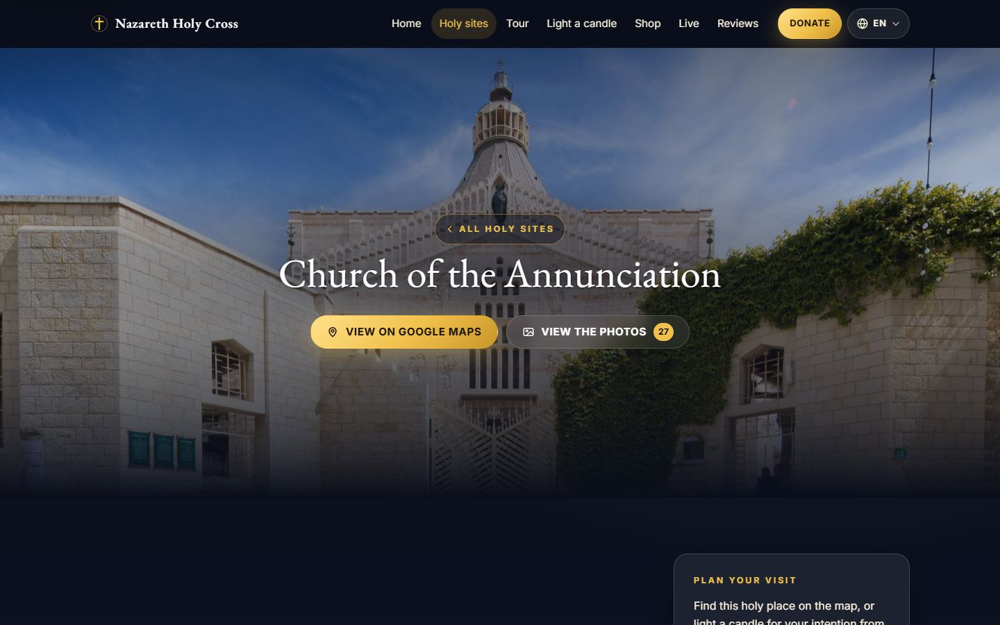
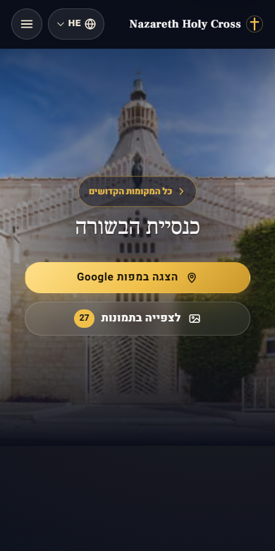

The photograph is the point: the hero veil is light on top, a soft pool of shade sits behind the title and the
foot fades into night. Each place has a `heroFocus` (object-position) so a narrow phone crop keeps the subject
(the basilica's tower, the chandelier, the dome of the city).

### 4.10 Print

`styles/print.css`: a holy-site page prints as a clean article (title, story, visit details), dark ink on white,
without header, footer, gallery, buttons, "more places" cards or floating controls; external links print their
address. `PageTools` has the Print button.

## 5. Right-to-left checklist

- Layout with logical properties; never `left`/`right`/`margin-left`.
- Arrows, chevrons, "back" icons: `flip` (or `.ui-flip-rtl`); hover nudges mirror too (see the 404 cards).
- Carousels: scroll maths uses `Math.abs(scrollLeft)`; arrow keys swap (see `SitesCarousel`, `LanguageSwitcher`).
- Progress and fills grow from the start edge (`transform-origin: right` under `[dir='rtl']`).
- Latin names, e-mail addresses, numbers inside sentences: `.ui-ltr`, `<bdi>` or `dir="auto"`.
- No letter-spacing and no uppercase in Hebrew/Arabic (`:lang()` rules).
- Test every new page in `/he` and `/ar` at 390px.

## 6. Accessibility

Checked with axe (WCAG 2.0 A/AA, 2.1 AA and 2.2 AA including target size) on the 12 main pages in English and
Hebrew at 1440 and 390px: no violations. Contrast: cream on night 16.8:1, muted 10.5:1, gold 11.3:1 (every pair: DESIGN-GUIDE.md section 3.2); gold buttons use
`#1a1405` text. Touch targets: header and footer controls are asserted at 44px by `ux.spec.ts`. Keyboard: skip
link, menus, focus return, drawer, photo viewer, carousel are covered by tests.

## 7. Adding to the system

1. Need a colour, size or shadow? Add a token (additive), then use it.
2. Need a new shared block? Put the class in `ui.css` (global, `ui-` prefix) or a component in `components/ui/`,
   add its states (hover, focus, active, disabled, reduced motion, RTL), and add it here with a screenshot.
3. Strings: add to every `messages/*.json`; the unit test checks the keys and placeholders.
4. Run `npm run lint && npm run typecheck && npm test && npx next build`, then `npx playwright test`.

### Build pitfall: `-webkit-backdrop-filter`

Do **not** write `-webkit-backdrop-filter` next to `backdrop-filter`. The production CSS minifier keeps only the
prefixed twin, and Chrome and Edge ignore it, so the blur silently disappears in the build (it works in dev).
Write `backdrop-filter` alone: the build adds the Safari prefix itself. Check with
`getComputedStyle(el).backdropFilter` in a production build.

*Specimen images of the building blocks (`ds-*.png`) are rendered from the real `tokens.css` and `ui.css` with
system fonts; page screenshots (`shell-*`, `page-*`) are from a production build with the real fonts.*
